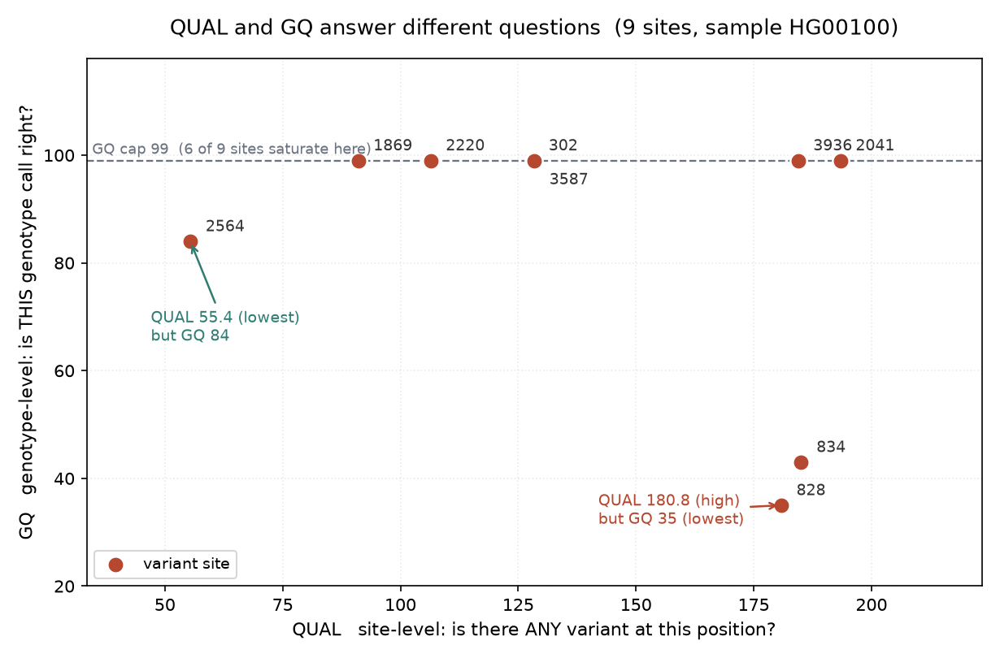
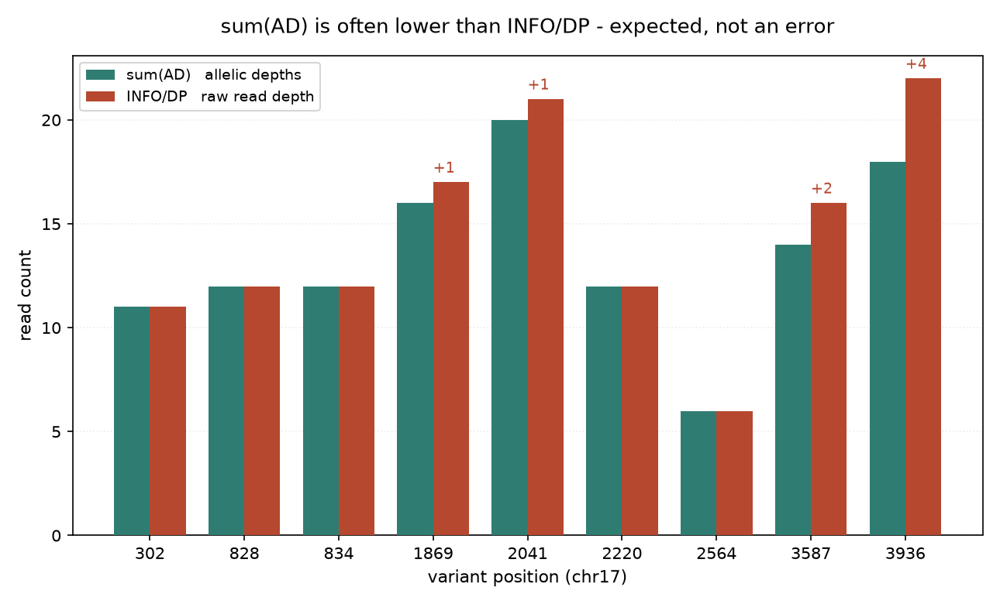
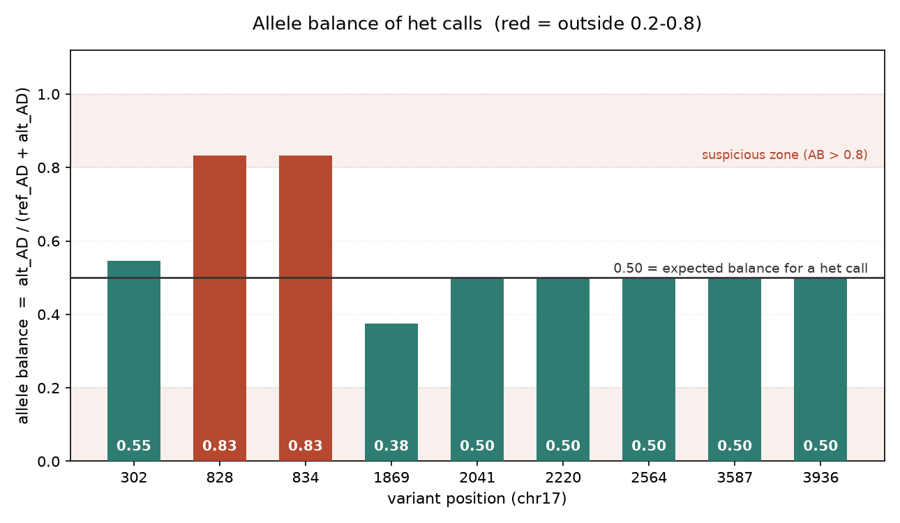

# VCF 字段解读与查询（016 / DEEP DIVE 13）

## 1 功能定位与适用范围

本 skill 覆盖 VCF/BCF 文件的查看、字段抽取、格式转换，以及字段语义的正确解读。SKILL.md 给出的统领原则是：一个字段只有在它的**层级（LEVEL）**和它的 **Number** 都确定之后才有意义。QUAL 是位点级属性；GQ、PL、AD、DP、GT 是每样本属性。QUAL 与 GQ 回答的是两个不同问题，不可互换。header 中的 Number（A/R/G/.）决定字段携带几个值、以及多等位拆分后如何重新取值。

内容覆盖：

- 查看与子集：`bcftools view`（`-h` 头、`-H` 跳头、区域、样本保留/排除）
- 字段抽取：`bcftools query -f` 格式串（`%CHROM %POS %REF %ALT %QUAL %FILTER %TYPE %INFO/TAG`，`[...]` 内为每样本循环）
- 格式转换与索引：`-Ov / -Oz / -Ou / -Ob`，`bgzip` + `bcftools index`（`-t` 出 tbi）
- Python 侧：`cyvcf2.VCF` 迭代、字段访问、区域抓取、`Writer` 写出
- 语义判定：QUAL vs GQ vs PL/GL、PL 索引公式、AD vs DP 与等位基因平衡、Number 语义、GT 编码与倍性、缺失 vs 纯合参考、符号等位与 `END`、gVCF `<NON_REF>` 参考置信模型

适用范围：已有 VCF/BCF 的检查、抽取、转换与字段语义判定。

不在本 skill 范围内：变异检出（`variant-calling`）、多等位拆分与左对齐及 Number 重分配（`variant-normalization`）、过滤阈值策略（`filtering-best-practices`）、gVCF 联合基因分型（`joint-calling`）、VCF 合并/取交并（`vcf-manipulation`）。

## 2 属性表

| 属性 | 值 |
|---|---|
| 主工具 | bcftools 1.24（要求 ≥ 1.19） |
| Python 库 | cyvcf2 0.34.0（要求 ≥ 0.30）、numpy 2.1.3（要求 ≥ 1.26） |
| 输入 | 015 真跑产物 `variants.vcf.gz`（bgzip 压缩 + csi 索引） |
| 输入规模 | 1 样本 HG00100、1 contig（17）、9 条变异记录（8 SNP + 1 INDEL） |
| header 声明 | 86 条 `##contig`、16 条 `##INFO`、4 条 `##FORMAT`（PL/DP/AD/GT） |
| CLI 格式串 | `%CHROM %POS %REF %ALT %QUAL %FILTER %TYPE %INFO/TAG`；`[...]` 内为每样本 |
| 输出格式 | `-Ov` 文本 VCF、`-Oz` bgzip VCF、`-Ou` 未压缩 BCF、`-Ob` 压缩 BCF |
| 索引 | `bcftools index` → `.csi`；`bcftools index -t` → `.tbi` |
| 本机环境 | brew 安装 bcftools 1.24 / samtools 1.21；managed venv Python 3.13.12 |

## 3 成分拆解

### 3.1 文件结构

- `SKILL.md`（353 行）：skill 定义。含统领原则、格式总览、header 契约、字段语义、bcftools/cyvcf2 命令模板、常见错误表、参考文献。
- `usage-guide.md`（97 行）：面向 agent 的用法文档。含依赖安装、快速开始、示例提示词（查看 / 抽取 / 转换 / Python 分析 / 字段解读五组）、执行步骤、Tips。
- `examples/view_vcf.py`（35 行）：skill 自带的唯一可执行示例，用 cyvcf2 打印样本名、contig 数与前 N 条变异的 `CHROM:POS REF>ALT QUAL FILTER TYPE`。
- 无自带 VCF 示例数据，需自备输入。

### 3.2 字段语义

**QUAL / GQ / PL / GL —— 四种不同的置信度**

| 字段 | 层级 | 标度 | 回答的问题 |
|---|---|---|---|
| QUAL（第 6 列） | 位点 | Phred：`-10*log10 P(no variant)` | 这个位点存在变异吗 |
| GQ（FORMAT） | 基因型 | Phred，上限 99 | 该样本被赋予的这个基因型对吗 |
| PL（FORMAT） | 基因型 | Phred，以 min=0 重定基 | 各可能基因型的相对似然 |
| GL（FORMAT） | 基因型 | log10，`<=0`，原始值 | 与 PL 同源，未缩放（`PL = -10*GL` 再重定基） |

QUAL 对全部样本只算一次，且随总深度放大，因此高覆盖的假象位点也可能有很高的 QUAL —— 过滤位点级噪声推荐用按深度归一化的 QD。GQ 是每样本的，不随队列规模放大。

**PL 的索引与 GQ 的推导**：PL 经重定基，被判定的基因型恰为 0，其余值是相对该判定的 Phred 罚分。二等位二倍体位点的 PL 顺序为 `[PL(0/0), PL(0/1), PL(1/1)]`，其中 0 所在的下标即 caller 判定的基因型。GQ = 两个最小 PL 值之差，上限 99；GQ=0 表示前两名基因型并列。n 个等位时，二倍体基因型 `j/k`（j≤k）位于 PL 下标 `k*(k+1)/2 + j`（即 `Number=G` 的排列）。多等位拆分后必须按该公式重新取值，不能按下标位置切片。

**AD 与 DP**：AD（FORMAT，`Number=R`）是每等位深度 `[ref_depth, alt1_depth, ...]`，REF 在前。DP 是总深度。`sum(AD)` 常小于 DP —— 属预期：DP 计入跨越该位点的全部读长（含低碱基质量、比对模糊、被过滤的读长），AD 只计入能明确支持某个等位的读长。`INFO/DP`（位点级，跨样本求和）与 `FORMAT/DP`（每样本）是两回事。

**等位基因平衡**：杂合位点的 `AB = alt_AD / (ref_AD + alt_AD)`，GATK 不直接输出，需从 AD 推导。真实杂合应接近 0.5；偏离到 `<0.2` 或 `>0.8` 指向比对假象、CNV 或污染。

**Number 语义（A / R / G / .）**

| Number | 每个值对应 | 例子 | 多等位拆分时 |
|---|---|---|---|
| `A` | 每个 ALT 等位 | AF、AC | 取第 k 个值给第 k 个 ALT |
| `R` | 含 REF 的每个等位 | AD | REF 值在前，其后是各 ALT（相对 A 差一位） |
| `G` | 每个基因型 | PL、GL | 按下标公式 `k*(k+1)/2+j` 重新取值 |
| `.` | 可变/未知 | -- | 解析器无法自动拆分，整条向量留在每条记录上 |
| `0` | 仅标记存在与否 | -- | -- |

`bcftools norm -m-` 依赖这些编码在拆分时重新分配字段。把实际是 `A` 的字段误声明为 `Number=.`，拆分后每条记录仍携带完整的多等位向量，下游读到的是错误等位的值且不报错。

**基因型编码与倍性**：`0/0` 纯合参考、`0/1` 杂合、`1/1` 纯合变异、`1/2` 多等位位点的复合杂合、`./.` 缺失、`0|1` 已定相。倍性由 GT 中等位个数读出（`0` 单倍体、`0/1` 二倍体、`0/1/1` 三倍体），按区域（PAR、男性 chrX、线粒体）的倍性须与样本核型一致。`.`（缺失）不是参考：`./.` 是无判定（通常低深度），`0/0` 是判定为纯合参考；把 `./.` 当作 `0/0` 会抬高参考等位计数，偏置等位频率、缺失率与负荷检验。

**符号等位与 gVCF**：`<DEL> <DUP> <INS> <INV> <CNV>` 为 SV 类别占位符；`<NON_REF>` 是 gVCF 的「尚未观测到的任意等位」；`*`（裸星号）是跨越缺失占位符，不是真实等位。`INFO/END` 给出符号/大事件的终止坐标 —— 用 `len(REF)` 推断记录跨度对符号等位是错误的。gVCF 对每个位置或区块都发记录，非变异区段压缩成按 GQ 分组的 END 区块，是中间产物而非过滤后的 callset，须经联合基因分型才得到常规 VCF。

### 3.3 经验记录

- `%INFO/AF` 与 `%GQ` 查询报 `Error: no such tag defined in the VCF header` —— 015 的 call 只声明了 PL/DP/AD/GT 四个 FORMAT 和 16 个 INFO，AF 与 GQ 未声明。修复路径：AF 用 SKILL.md 推荐的 `bcftools +fill-tags ... -- -t AF` 补齐；GQ 按其公式从 PL 推导。
- `bcftools view -s ^sample` 剥离样本列后位点记录数不变 —— 该操作只作用于样本维度，9 条位点记录仍全部保留，同时输出 `Warn: subsetting has removed all samples`。位点层级与样本层级在此处分离。
- `bcftools +fill-tags ... 2>&1 | grep -v` 这类管道的退出码来自 `grep`，不反映 bcftools 是否成功；判成败要看命令自身的退出码。
- skill 自带 `examples/view_vcf.py` 中 `filt = variant.FILTER if variant.FILTER else 'PASS'` 是脚本内的兜底写法，与 SKILL.md 的语义（`.` = 未施加过滤，PASS = 通过过滤）不同。本输入 FILTER 列实际为 `.`，脚本打印为 `PASS`。
- `MQ should be declared as Type=Float` 是 htslib 对 MQ 字段类型一致性的 cosmetic 警告，不影响输出内容。
- plain gzip 压缩的 VCF 不可随机访问：`bcftools index` 报 `the file is not BGZF compressed, cannot index`，区域查询报 `Failed to read from ...: not compressed with bgzip`。压缩必须用 `bgzip`。

## 4 严格复现

### 4.1 环境与数据

- bcftools 1.24、samtools 1.21、cyvcf2 0.34.0、numpy 2.1.3、Python 3.13.12（managed venv）。
- 输入：015 真跑产出的 `variants.vcf.gz`（bcftools mpileup\|call，chr17:1-4200，样本 HG00100，9 变异）。本次不引入新数据源。
- 该输入为**单样本、9 个二等位位点、全部 `0/1` 杂合**。因此以下 SKILL.md 知识点在本次输入中无对应记录，不做演示：gVCF `<NON_REF>` 与参考区块、`1/2` 多等位基因型、相位 `0|1` 与 PS 相位集、符号等位 `<DEL>` 与 `END`、`./.` 缺失基因型与单倍型位点。相关结论在下文按 SKILL.md 原文陈述，不以构造数据补演。

### 4.2 第一组：`bcftools view`

```bash
bcftools view variants.vcf.gz | grep -v "^##" | head -4
```

```
#CHROM	POS	ID	REF	ALT	QUAL	FILTER	INFO	FORMAT	HG00100
17	302	.	T	TA	128.226	.	INDEL;IDV=5;IMF=0.454545;DP=11;...;AC=1;AN=2;DP4=1,4,4,2;MQ=48	GT:PL:DP:AD	0/1:161,0,99:11:5,6
17	828	.	T	C	180.829	.	DP=12;...;AC=1;AN=2;DP4=1,1,3,7;MQ=60	GT:PL:DP:AD	0/1:216,0,35:12:2,10
17	834	.	G	A	185.079	.	DP=12;...;AC=1;AN=2;DP4=1,1,3,7;MQ=60	GT:PL:DP:AD	0/1:220,0,43:12:2,10
```

header 中的 FORMAT 声明（`-h`）：

```
##FORMAT=<ID=PL,Number=G,Type=Integer,Description="List of Phred-scaled genotype likelihoods">
##FORMAT=<ID=DP,Number=1,Type=Integer,Description="Number of high-quality bases">
##FORMAT=<ID=AD,Number=R,Type=Integer,Description="Allelic depths (high-quality bases)">
##FORMAT=<ID=GT,Number=1,Type=String,Description="Genotype">
```

索引 + 区域查询（SKILL.md：区域查询需要索引）：

```bash
bcftools index variants.vcf.gz                 # exit=0，生成 variants.vcf.gz.csi
bcftools view variants.vcf.gz 17:300-900       # 返回 302 / 828 / 834 三条
```

样本保留与排除：

```bash
bcftools view -s HG00100 variants.vcf.gz | grep -vc "^#"     # 9
bcftools view -s "^HG00100" variants.vcf.gz                   # 位点仍为 9 条
```

`-s ^` 换引号前后结果一致，说明差异不在 shell 转义。实际行为是：表头列数由 10 降为 8（样本列被剥离），9 条位点记录全部保留，并输出 `Warn: subsetting has removed all samples`。

### 4.3 第二组：`bcftools query`

```bash
bcftools query -f '%CHROM\t%POS\t%REF\t%ALT\n' variants.vcf.gz
bcftools query -f '%CHROM\t%POS[\t%GT]\n' variants.vcf.gz
bcftools query -f '%CHROM\t%POS[\t%SAMPLE=%GT]\n' -s HG00100 variants.vcf.gz
bcftools query -H -f '%CHROM\t%POS\t%REF\t%ALT\n' variants.vcf.gz
```

输出（真实）：`%CHROM %POS %REF %ALT` 得到 9 行（302 T>TA、828 T>C、834 G>A、1869 A>T、2041 G>A、2220 G>A、2564 A>G、3587 G>A、3936 A>G）；`[\t%GT]` 每行追加 `0/1`；`-s HG00100` 追加 `HG00100=0/1`；`-H` 追加列名行 `#[1]CHROM [2]POS [3]REF [4]ALT`。

SKILL.md 模板中另两条在本输入上返回错误：

```bash
bcftools query -f '%CHROM\t%POS\t%INFO/DP\t%INFO/AF\n' variants.vcf.gz
# Error: no such tag defined in the VCF header: INFO/AF   (exit=255)

bcftools query -f '%CHROM\t%POS\t%TYPE\t%QUAL[\t%GT\t%GQ]\n' variants.vcf.gz
# Error: no such tag defined in the VCF header: FORMAT/GQ  (exit=255)
```

AF 按 SKILL.md 推荐的 fill-tags 补齐后重新查询：

```bash
bcftools +fill-tags variants.vcf.gz -Oz -o variants.filled.vcf.gz -- -t AF   # exit=0
bcftools query -f '%POS\tAC=%INFO/AC\tAN=%INFO/AN\tAF=%INFO/AF\n' variants.filled.vcf.gz
```

```
302	AC=1	AN=2	AF=0.5
828	AC=1	AN=2	AF=0.5
834	AC=1	AN=2	AF=0.5
```

单样本杂合位点的 `AF = AC/AN = 1/2 = 0.5`，与 GT 一致。

### 4.4 第三组：格式转换与索引

```bash
bcftools view -Ob -o variants.bcf variants.vcf.gz        # VCF.gz -> BCF      2591 bytes
bcftools view -Ov -o variants.roundtrip.vcf variants.bcf # BCF -> VCF         127 行
bgzip variants.roundtrip.vcf                             # -> .vcf.gz（bgzip，非 gzip）
bcftools index variants.roundtrip.vcf.gz                 # -> .csi
bcftools index -t variants.roundtrip.vcf.gz              # -> .tbi
```

plain gzip 反例（验证 SKILL.md「plain .gz 不可随机访问」）：

```bash
gzip -c variants.plain.vcf > variants.gzip.vcf.gz
bcftools index variants.gzip.vcf.gz
# index: the file is not BGZF compressed, cannot index: variants.gzip.vcf.gz
bcftools view variants.gzip.vcf.gz 17:300-900
# Failed to read from variants.gzip.vcf.gz: not compressed with bgzip
```

### 4.5 cyvcf2 侧

skill 自带示例脚本：

```bash
python examples/view_vcf.py variants.vcf.gz 5
```

```
Samples: HG00100
Contigs: 86

17:302	T>TA	QUAL=128.2	FILTER=PASS	TYPE=indel
17:828	T>C	QUAL=180.8	FILTER=PASS	TYPE=snp
17:834	G>A	QUAL=185.1	FILTER=PASS	TYPE=snp
17:1869	A>T	QUAL=91.0	FILTER=PASS	TYPE=snp
17:2041	G>A	QUAL=193.4	FILTER=PASS	TYPE=snp
```

脚本打印的 `FILTER=PASS` 来自其 `variant.FILTER if variant.FILTER else 'PASS'` 兜底；`bcftools query -f '%POS\tFILTER=[%FILTER]\n'` 显示原始值为 `.`，即该 callset 未施加过滤。

SKILL.md「Genotypes and Per-Sample Fields」片段（本输入无 GQ 标签，`variant.format('GQ')` 返回 None，故 GQ 按公式从 PL 推导）：

```
POS=302	gt_types=[1]	DP=[[11]]	AD=[[5, 6]]	PL=[161, 0, 99]	GQ=99
POS=828	gt_types=[1]	DP=[[12]]	AD=[[2, 10]]	PL=[216, 0, 35]	GQ=35
POS=834	gt_types=[1]	DP=[[12]]	AD=[[2, 10]]	PL=[220, 0, 43]	GQ=43
POS=1869	gt_types=[1]	DP=[[16]]	AD=[[10, 6]]	PL=[124, 0, 220]	GQ=99
POS=2041	gt_types=[1]	DP=[[20]]	AD=[[10, 10]]	PL=[226, 0, 214]	GQ=99
POS=2220	gt_types=[1]	DP=[[12]]	AD=[[6, 6]]	PL=[139, 0, 130]	GQ=99
POS=2564	gt_types=[1]	DP=[[6]]	AD=[[3, 3]]	PL=[88, 0, 84]	GQ=84
POS=3587	gt_types=[1]	DP=[[14]]	AD=[[7, 7]]	PL=[161, 0, 184]	GQ=99
POS=3936	gt_types=[1]	DP=[[18]]	AD=[[9, 9]]	PL=[217, 0, 210]	GQ=99
```

区域抓取（需索引，本数据 contig 名为 `17`）：

```python
vcf = VCF('variants.vcf.gz')
list(vcf('17:300-900'))   # -> [('17', 302), ('17', 828), ('17', 834)]
```

### 4.6 SKILL.md 三条论断的实测

**（1）PL 索引公式 `k*(k+1)/2 + j`**：9 个位点的 PL 向量中，最小值 0 全部落在下标 1，`k*(k+1)/2+j` 取 `j=0, k=1` 得 1，与 GT 列的 `0/1` 一致。

**（2）`sum(AD)` 常小于 `INFO/DP`**：9 个位点中 4 个存在差值 —— 3936 差 4（AD 9+9=18，DP 22）、3587 差 2（14 vs 16）、1869 差 1（16 vs 17）、2041 差 1（20 vs 21）；其余 5 个相等。DP 计入跨越位点但不支持特定等位的读长，差值方向单向为正。

**（3）QUAL 与 GQ 不可互换**：9 个位点的 QUAL 跨 55.4–193.4，GQ 跨 35–99，其中 6 个位点的 GQ 顶到 99 上限（302、1869、2041、2220、3587、3936）。排序冲突的两个位点：828 的 QUAL 180.8 排第 4 高，GQ 35 为全组最低；2564 的 QUAL 55.4 为全组最低，GQ 84 高于 828（35）与 834（43）。







**（4）等位基因平衡**：9 个位点全部为 `0/1` 杂合，AB 分布为 0.38（1869）、0.50（2041/2220/2564/3587/3936）、0.55（302）、0.83（828）、0.83（834）。828 与 834 落在 SKILL.md 给出的 `>0.8` 可疑区间，两者 AD 均为 `2, 10` 且 `sum(AD) == INFO/DP`，与 0.50 的期望偏离较大。

## 5 实践要点

- 过滤分两层：位点级噪声看 QUAL/QD（QD 按深度归一化，优于裸 QUAL）；每样本基因型不可信看 GQ。两者不可互相替代。
- 读字段前先读 header：tag 未声明时 `bcftools query` 直接报 `no such tag defined` 并以 255 退出，不会静默返回空。AF 一类派生标签用 `bcftools +fill-tags -- -t <TAG>` 补齐。
- 补字段后需回查 header 同步情况；手工编辑或注释新增字段后，header 的 ID/Number/Type 必须与正文一致。
- 压缩一律用 `bgzip`，索引用 `bcftools index`（`-t` 出 tbi）。plain gzip 在 `index` 与区域查询两步都会失败。
- 管道中判断命令成败要取命令自身的退出码，`cmd 2>&1 | grep -v` 拿到的是 `grep` 的退出码。
- 深度相关计算区分三个量：`INFO/DP`（位点级跨样本）、`FORMAT/DP`（每样本）、`sum(AD)`（每样本，仅支持特定等位的读长）。`sum(AD) < DP` 属预期。
- 杂合位点的 `AB = alt_AD/(ref_AD+alt_AD)` 需自行从 AD 推导；偏离 0.5 的 het 指向比对假象、CNV 或污染。
- 缺失（`./.`）与纯合参考（`0/0`）是两回事，负荷检验与等位频率计算中不得把前者当后者。
- 多等位拆分后，PL 必须按 `k*(k+1)/2+j` 重新取值而非按下标切片；`Number=.` 的字段不会被自动重分配。
- 提交分析前先确认输入是不是 gVCF：带 `<NON_REF>` 与参考区块的是中间产物，须先联合基因分型，不做过滤、注释或变异计数。

## 未覆盖（诚实标注）

本次输入为 015 真跑产出的单样本 VCF（HG00100，chr17，9 个变异：8 SNP + 1 INDEL，全二等位、全杂合）。以下 SKILL.md 涉及的记录类型在本次输入中无对应样本，未做实测，相关结论按 SKILL.md 原文陈述，未以构造数据演示：

- **gVCF `<NON_REF>` 与参考区块**：`<NON_REF>` 等位、END 区块表示、区块合并与联合基因分型前处理。
- **多等位位点**：`1/2` 基因型、拆分后的 PL 按 `k*(k+1)/2+j` 重取、`Number=.` 字段的重新分配。
- **相位信息**：`0|1` 定相基因型与 PS 相位集的读写。
- **符号等位**：`<DEL>` 一类符号表示及其 INFO/END 配套字段。
- **缺失基因型**：`./.` 与 `0/0` 在计数、等位频率与负荷检验中的区分。

上述项目需多等位、定相或 gVCF 类型的输入才能演示。后续若有相应数据，可复用本篇第 4 节的命令组逐项补齐实测。

## 6 小结

本 skill 的三组 bcftools 命令（`view` / `query` / 格式转换与索引）与三组 cyvcf2 片段（字段迭代、区域抓取、skill 自带示例脚本）在 015 真跑产出的单样本 VCF（HG00100，chr17，9 变异：8 SNP + 1 INDEL）上全部执行成功。SKILL.md 的四条论断在真实数据上得到验证：PL 向量中 0 的下标与 GT 一致（9/9）；`sum(AD) ≤ INFO/DP` 且 4 个位点存在 1–4 的正向差值；QUAL 与 GQ 给出不同的位点排序（828 高 QUAL 低 GQ、2564 低 QUAL 较高 GQ，6/9 位点 GQ 顶到 99 上限）；等位基因平衡中 828 与 834 落在 `>0.8` 区间。

同时记录了三条与输入 header 相关的行为：AF 与 GQ 未声明导致 query 以 255 退出（AF 经 `+fill-tags` 补齐为 0.5，GQ 按公式从 PL 推导）；`-s ^sample` 只剥离样本列、位点记录数不变；plain gzip 在索引与区域查询两步均失败。

本次输入为单样本、全二等位、全杂合，gVCF `<NON_REF>`、多等位 `1/2`、相位 `0|1` 与 PS、符号等位 `<DEL>` 与 `END`、`./.` 缺失基因型在该输入中无对应记录，相关结论按 SKILL.md 原文陈述，未以构造数据演示。
