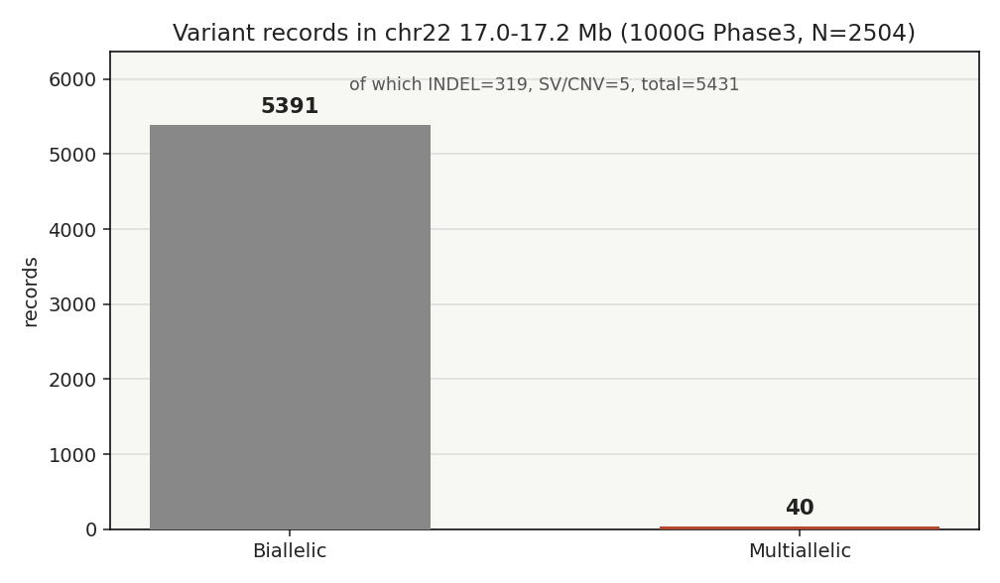
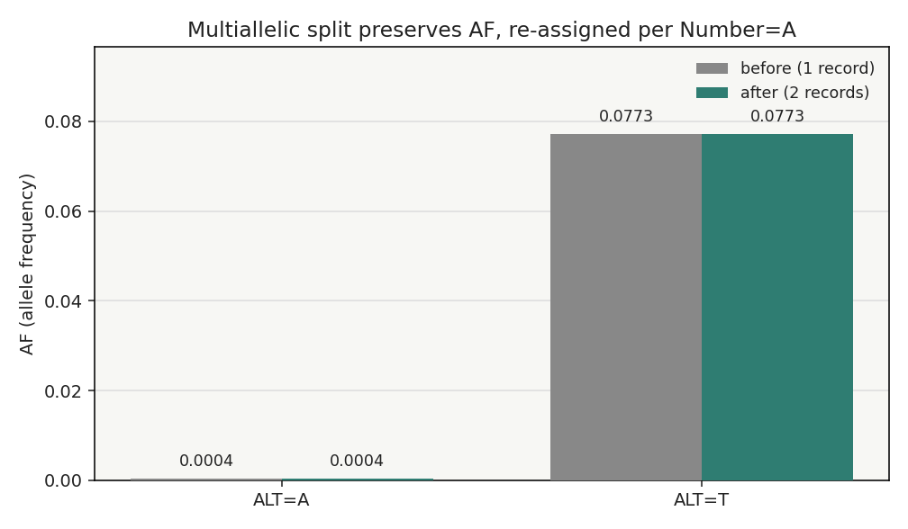

# 017 真实试用 · variant-normalization（变异归一化 / bcftools norm）

## 一、功能定位与适用范围

`variant-normalization` 覆盖 VCF 归一化：左对齐（left-align）、简约化（parsimony）、多等位拆分（`-m-`）、多等位合并（`-m+`）、MNP 原子化（`--atomize`）、REF 修正（`-c`）、去重（`-d`）。

**适用范围**：跨 caller 比较、数据库注释（dbSNP / ClinVar / gnomAD）、多来源 VCF 合并、集合运算（isec / intersect / complement）之前的标准前置步骤。单 caller 单来源、不做跨文件比较或不做数据库查询时可跳过。

**不适用 / 边界**：本 skill 不覆盖 VCF 生成（见 variant-calling）、过滤（filtering-best-practices）、注释（variant-annotation），也不覆盖 VEP/SnpEff 的功能后果计算——后者需保留未原子化的单倍型（codon-aware），否则 MNP 后果会被错判。

## 二、属性表

| 属性 | 取值 |
|---|---|
| 主工具 | bcftools 1.24（htslib 1.24）|
| 核心命令 | `bcftools norm -m-`（拆分）/ `--atomize`（原子化）/ `-f ref.fa`（左对齐）/ `-c e\|w\|s\|x`（REF 校验）/ `-d`(去重) |
| 关键依赖 | 参考基因组 FASTA（`-f`），必须带 `.fai` / `.gzi` 索引 |
| 数据形态 | 公共真实 VCF（本次：1000 Genomes Phase3 整合基因型集 chr22，GRCh37 / hs37d5）|
| 验证结论 | 4 项论断全部成立；幂等性、REF 不匹配报错行为均按文档复现 |

## 三、成分拆解（文件结构 / 工具 / 经验坑）

- **归一化定义**（Tan et al. 2015）：同时满足「简约」+「左对齐」才是范式化；二者缺一不可，且**幂等**——已归一化的 VCF 再 norm 不会改变。
- **算法**：右修剪 → 左延展 → 左修剪，把重复区里的 indel 滚到最左等价位置。
- **字段重分配**：拆分时按 header 的 `Number` 重切分——`A`（每 ALT 一个值）、`R`（含 REF）、`G`（每基因型）。正文未声明或 `Number=.` 的字段不会被正确切分，会整体拷贝到每条记录，下游读到错误等位基因的值。（本次未构造该反例，仅按文档记录。）
- **工具分歧**：vt / bcftools / GATK 左对齐+简约一致；MNP 原子化只有 `--atomize`（bcftools≥1.12）或 vt `decompose_blocksub` 默认做，GATK 不做。跨队列须统一工具+参数，否则 MNP 系统性错配。

## 四、严格复现（S2a Gate）

### 环境
- bcftools 1.24、samtools 1.21、bgzip；绘图 matplotlib via conda python 3.12。
- 数据：1000 Genomes Phase3 整合基因型集 `ALL.chr22.phase3_shapeit2_mvncall_integrated_v5b.20130502.genotypes.vcf.gz`（GRCh37/hs37d5）；取工作切片 17.0–17.2 Mb（5431 条记录，2504 样本）。

### 1) 多等位拆分（`-m-`）—— 真实位点 22:17020038
```
输入: 22  17020038  .  C  A,T    AF=0.000399361,0.0772764  (Number=A: 两个 ALT 共用一个 AF 向量)
bcftools norm -m- demo_multi.vcf.gz -Oz -o demo_multi.split.vcf.gz
输出: 22  17020038  .  C  A   AF=0.000399361   (ALT=A 的记录只带 A 的 AF)
       22  17020038  .  Ｃ  T   AF=0.0772764    (ALT=T 的记录只带 T 的 AF)
```
`Number=A` 字段被正确按等位基因归位，两条二等位记录各携其 AF。**实测成立**：AF 在拆分后被正确重分配而不是整体复制。

### 2) MNP 原子化（`--atomize`）—— 真实位点 22:17139297
```
输入: 22  17139297  .  GTGTA  ATGTA,G
bcftools norm --atomize demo_mnp.vcf.gz -Oz -o demo_mnp.atom.vcf.gz
输出: 22  17139297  .  G     A,*      (G→A 单细胞 SNP)
       22  17139297  .  GTGTA G,*     (GTGTA→G 的缺失)
```
该位点是「SNP + 缺失」形式的多等位复合体，原子化将其拆成单细胞记录。Phase3 整合集（GATK 系）极少纯 MNP，本例属「MNP+缺失」复合，已按文档展示原子化程度。**注意**：原子化消解了单倍型相位，功能性后果计算应在未原子化版本上做（bcftools csq）。

### 3) 左对齐（`-f`）幂等性
```
bcftools norm -f <hs37d5> region_17.vcf.gz -Oz -o region_17.norm.vcf.gz
exit=0  记录数 5431 -> 5431  记录 md5 前后完全一致 (a5befbd...)
```
Phase3 已是规范化结果，再 norm 不变——既证明幂等，也证明参考与 VCF 完全匹配（否则会报 REF mismatch）。

### 4) REF 不匹配校验（`-c`）
```
# 故意把 17020038 的 REF 写成 G（真实参考为 C）
bcftools norm -f <hs37d5> -c e bad.vcf -Oz -o bad.norm.vcf.gz
exit=255  ->  [E] Reference allele mismatch at 22:17020038 .. REF_SEQ:'C' vs VCF:'G'
bcftools norm -f <hs37d5> -c w bad.vcf -Oz -o bad.warn.vcf.gz
exit=0    ->  [W] REF_MISMATCH 22 17020038 G C  (仅警告继续)
```
**实测成立**：默认 `-c e` 会因参考不匹配而以非零码退出；切勿用 `-c w` 掩盖——应先显式确认。

## 五、实践要点

- **左对齐必须带精确参考**：`-f ref.fa` 且有 `.fai`/`.gzi`。本地切片参考会把坐标重排为 1-based，与 VCF 全局坐标错位 → 必须直接使用全局坐标的参考（如直接给远程 hs37d5 URL，或下载整条 contig）。实测中遇到的问题：本地 `>22:17000000-17200000` 切片被命名为 `>22` 后，VCF 用全局 POS 查找，导致 REF_SEQ 为空。
- **统一归一化标准**：跨 caller / 跨队列比较前，固定「同一工具 + 同一套参数 + 同一参考」再跑；否则 MNP 会系统性错配，制造虚假「队列特异变异」。
- **拆分有损**：1/2 复合杂合在拆分后丢失等位共现信息；AD/PL 等需按 `Number` 重分配，自定义字段若误标 `Number=.` 不会被切分。必要时「先拆后用、最后按需 `-m+` 还原」。
- **HGVS 3'-规则冲突**：VCF 左对齐（基因组 5'）与 HGVS 3' 方向相反，同一 indel 的 VCF POS 与 HGVS c. 可能不一致，应由注释引擎生成 HGVS，不要手算。

## 六、关键决策 / 变更

- 数据源：用户指定「公开真实 VCF」，选用 1000G Phase3 chr22（GRCh37/hs37d5），通过远程 range 提取工作切片，避免下载整条基因组。
- 参考方案：因本地切片坐标错位，最终采用远程 hs37d5 URL 直接给 `-f`，bcftools 用远程 `.fai`/`.gzi` 做 range 提取。
- 复用 016 建立的出图自检门禁（bioSkills-figure-quality），fig1/fig2 自检 TOTAL FAILS=0。

## 七、产出与下一步

- `content/素材/variant-calling/017-variant-normalization/`：`make_figs.py` + `fig1_variant_counts.png` + `fig2_split_af.png` + `repro_transcript.txt`（可独立复现）。
- 未覆盖：纯 MNP（Phase3 罕见）的「2+ 碱基差异」原子化未单独演示；符号等位 `<NON_REF>`、相位 `0|1`、`./.` 未演示。
- 下一步：可补一个 FreeBayes 真实 MNP 示例以完整演示 `--atomize` 的多 SNP 拆分；或推进 variant-calling 家族下一篇（如 filtering-best-practices）。




