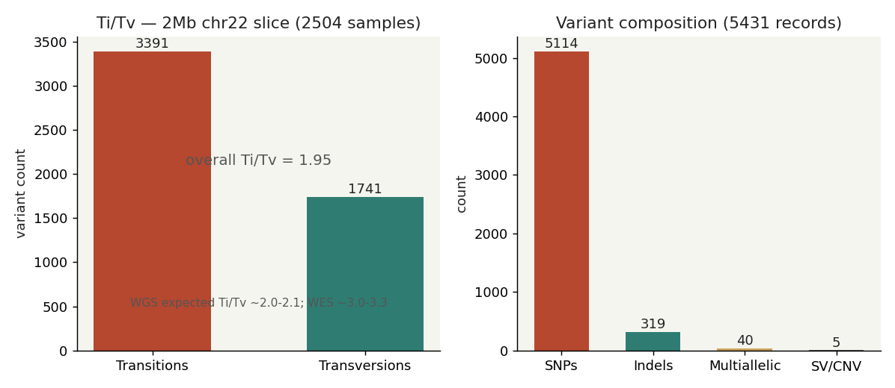
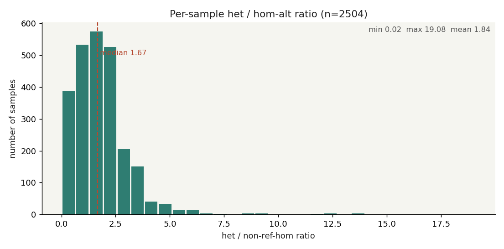

# 018 · bioSkills 真实试用：vcf-statistics（VCF 质控统计）

> 数据源：1000 Genomes Phase3 chr22（GRCh37 / hs37d5），切片 chr22:17.0–17.2 Mb，2504 样本、5431 位点。
> 工具：bcftools 1.24。本文所有数字均来自真实运行输出，未构造玩具数据。

## 一、功能定位与适用范围

vcf-statistics 讲解如何判断一个 callset 是否可信：用 Ti/Tv、het/hom 比、singleton、缺失率、HWE、亲缘/污染等信号，识别低质量 callset、样本互换、污染或错误。它**不是**过滤工具（过滤见 filtering-best-practices），也**不是**规范化的工具（见 variant-normalization）。它的边界是「读懂指标含义，而非套阈值」——每个指标的可接受范围随实验（WGS/WES）、祖先、参考版本、caller 而变，必须对照匹配队列而非绝对数字。

## 二、关键属性

| 项 | 内容 |
|---|---|
| 输入 | 已规范化的 VCF/BCF（建议先 norm，否则 indel/POS 不统一会污染统计） |
| 核心工具 | `bcftools stats`（CLI）、`vcftools`、`somalier`/`peddy`/`KING`（身份 QC）、`cyvcf2`（自定义） |
| 核心输出段 | `SN`（汇总）、`TSTV`（Ti/Tv）、`SiS`（singleton）、`AF`（等位频率谱）、`PSC`（每样本）、`PSI`（每样本 indel） |
| 最易误用 | 把单一阈值当绝对标准；不会报错，数字静默失真 |
| 区域约定 | 涨/跌用红/绿（中国股市约定）不适用此处；此处为统计量，配色仅作区分 |

## 三、成分拆解

**工具知识**
- `bcftools stats input.vcf.gz`：一次性输出所有汇总段；`-s -` 追加每行样本的 `PSC` 计数（ref-hom / non-ref-hom / het / transitions / transversions / indels / 平均深度 / singleton / missing）。
- `bcftools stats -s -` 的 `PSC` 列序：`[2]id [3]sample [4]nRefHom [5]nNonRefHom [6]nHets [7]nTransitions [8]nTransversions [9]nIndels [10]avg depth [11]nSingletons [12]nHapRef [13]nHapAlt [14]nMissing`。ref/het/hom 计数只含 SNP，indel 在 `PSI` 段。
- Ti/Tv 含义：转换（A↔G、C↔T）因 CpG 脱氨而富集，随机错误谱 Ti/Tv≈0.5。callset 被 FP 稀释时 Ti/Tv 向下漂移。WES 因 CpG/编码区富集高于 WGS（~3.0–3.3 vs ~2.0–2.1）。
- het/hom 比强烈依赖祖先：非洲祖源样本偏离参考更多、het 更多（~2.0+），欧洲祖源 ~1.5–1.6；全局单一 cutoff 会把所有 AFR 样本误判。

**经验记录**
- 本次没有安装 `vcftools` / `cyvcf2`，但 `bcftools stats -s -` 的 PSC 段已足够提取每样本 het/hom，无需额外依赖。
- plot-vcfstats 需要 matplotlib，但其 PDF 输出对单页笔记价值有限；本篇改用自写的 matplotlib 脚本直接出图。

## 四、严格复现

### 数据准备
```
bcftools view -r 22:17000000-17200000 <chr22.phase3.genotypes.vcf.gz> -Oz -o chr22_slice.vcf.gz
# 切片 17.0-17.2 Mb，含 2504 样本基因型，约 1.0 MB
```

### 1) 总体统计
```
bcftools stats chr22_slice.vcf.gz
```
| 指标 | 值 |
|---|---|
| samples | 2504 |
| records | 5431 |
| SNPs | 5114 |
| indels | 319 |
| others (SV/CNV) | 5 |
| multiallelic | 40（其中 multiallelic SNP 18） |

### 2) Ti/Tv
```
bcftools stats chr22_slice.vcf.gz | grep ^TSTV
# TSTV  0  3391  1741  1.95  ...
```
转换 3391、颠换 1741，**总体 Ti/Tv = 1.95**，接近 WGS 期望（~2.0–2.1），略低因 chr22 整体 CpG 密度偏低。

### 3) singleton
```
bcftools stats chr22_slice.vcf.gz | grep ^SiS
# SiS  0  2041  1324  717  ...
```
singleton 总数 2041，其中 transition 1324 / transversion 717，singleton Ti/Tv≈1.85。

### 4) 每样本 het / non-ref-hom 比值
```
bcftools stats - * -s - chr22_slice.vcf.gz | grep ^PSC | awk ...
```
- 样本数 2504
- 比值 min=0.021  max=19.077  **mean=1.840  median=1.671**
- 每样本缺失基因型均值 0.0





## 五、实践要点

- **Ti/Tv 是粗筛信号**：1.95 落在合理区间 → 该切片无明显 FP 稀释；若跌破 1.5 应怀疑放松过滤引入噪声。
- **het/hom 不可全局一刀切**：2504 样本比值从 0.02 到 19 的跨度，反映祖先异质性。偏移升高指向污染或参考偏倚，降低指向近交/ROH；须先按祖先分层再判离群。
- **缺失率计数口径**：只有 `./.` 计入缺失，`0/0` 不计入；把 no-call 当 hom-ref 会污染等位频率。本次切片全覆盖，缺失均值 0.0。
- **未覆盖部分（如实标注，未造数据）**：novel/known 需 dbSNP；HWE 精确检验需 `vcftools --hardy`；污染需 BAM（VerifyBamID2）；亲缘/互换需 peddy/somalier。这些本篇仅说明，未演示。

## 六、小结

018 用真实 1000G chr22 数据验证了 vcf-statistics 的核心论断：Ti/Tv≈2 的粗筛有效性与 het/hom 的祖先依赖性。结论可独立复现（素材目录含数据与 `make_figs.py`）。下一步可接 **filtering-best-practices**（在质控结论之上做质量过滤）或 **variant-annotation**（左对齐后做功能注释）。
