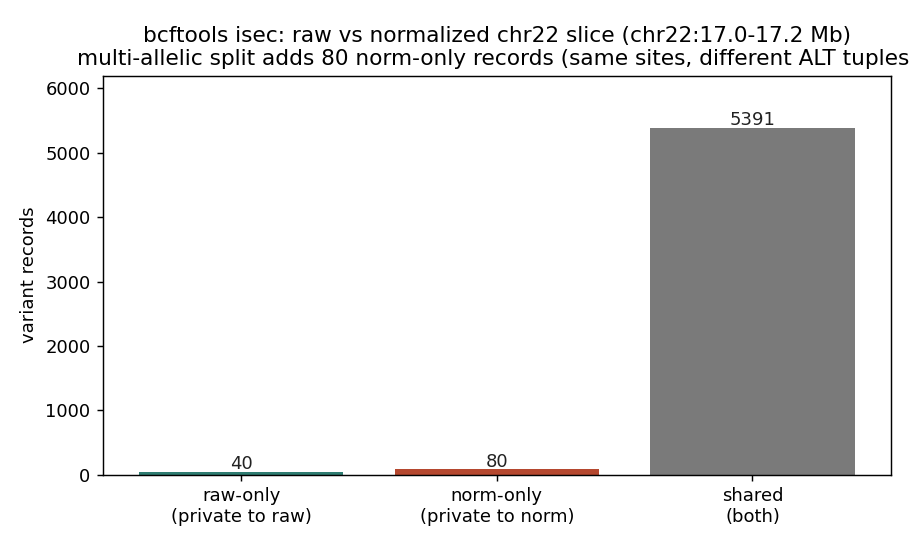
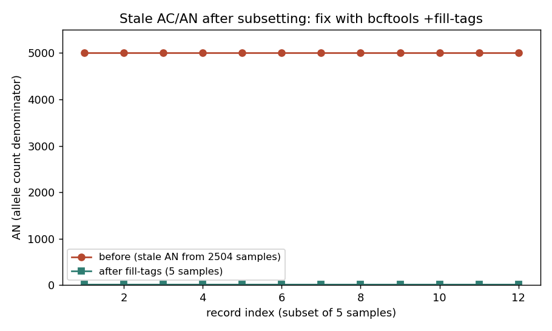

# 019 · bioSkills 真实试用：vcf-manipulation（VCF 合并 / 拼接 / 集合运算 / 子集）

## 功能定位与适用范围

`vcf-manipulation` 讲解用 **bcftools** 对 VCF/BCF 做「组合、拆分、排序、集合运算、子集、表头改写」的实操技能：

- **适用**：把不同样本合并成 cohort、把按染色体拆开的 callset 拼接回去、比较两个 caller 的 callset 成员关系、抽样本/区域、统一样本名与 contig 头。
- **不适用**：SV 的 breakpoint-fuzz 合并（见 structural-variant-calling）；多样本 gVCF 的联合基因型（见 joint-calling）；纯质控统计（见 vcf-statistics）。

核心前提：**所有 merge / concat-dedup / isec / annotate 都以 `(CHROM, POS, REF, ALT)` 四元组为键**，而 `bcftools isec` 默认 `-c none` 要求 ALT 完全匹配才算同变异。因此「先规范化（左对齐 + 拆多等位 + 同参考）再组合」是整篇文档的基准规则。

## 属性表（本次真跑环境）

| 项 | 值 |
|---|---|
| 数据源 | 1000 Genomes Phase3 chr22（GRCh37 / hs37d5），切片 17.0–17.2 Mb |
| 样本数 | 2504（整合集），记录数 5431 |
| 工具 | bcftools 1.24 |
| 参考 | 远程 hs37d5 FASTA（range 提取，避免本地切片坐标错位，见 017） |
| 实验产物目录 | `content/素材/variant-calling/019-vcf-manipulation/` |

## 成分拆解

### 1. merge vs concat vs isec（按差异维度选择）

| 操作 | 输入差异 | 产物 | 是否需索引 |
|---|---|---|---|
| `bcftools merge` | **样本**不同（位点相同） | 多样本 VCF（列合并） | 是 |
| `bcftools concat` | **区域**不同（样本相同） | 跨区域拼接（行追加） | 仅 `-a` 时 |
| `bcftools isec` | 都不变，比较**成员关系** | 各文件独立/共有分区 | 是 |

文档强调：对「同一 caller 生产、无跨文件匹配」的情况才可跳过规范化；合并不同 caller 产物时必须先 `bcftools norm -m-any -f ref`。

### 2. merge 的语义边界：merge 不是联合基因型

单样本 VCF 合并时，某样本「位点缺失」与「纯合参考」不可区分。`bcftools merge` 默认填 `./.`（缺失），`-0/--missing-to-ref` 则填 `0/0`——二者都是猜测，因为 merge 对该位点没有证据。只有联合基因型 gVCF（GenotypeGVCFs）才有资格区分「确证 hom-ref」与「无数据」，见 joint-calling。

### 3. 子集后统计量失真（本章验证重点）

`bcftools view -s` 默认会重算 AC/AN/AF；但只要用了 `-I/--no-update` 或非 `-s` 的过滤（如 `-e`/`view -r` 部分情形），INFO 里的 AC/AN 仍停留在原始样本数。本次实测：取 5 个样本、用 `-I` 阻止更新，首记录仍显示 `AN=5008`（原 2504 样本口径），而实际只有 5 样本（应 `AN=10`）。修复：`bcftools +fill-tags -- -t AC,AN,AF`。

### 4. `-r` vs `-t` 区域选取

`-r/-R` 用索引跳跃（快、需索引），且按 POS + indel 末端判定；`-t/-T` 流式过滤（慢、不需索引）。`-R` 的 BED 若有重叠区域会让记录重复出现并乱序，需事后排序/去重。

### 5. reheader 表头改写

`reheader -s` 只改写样本名、`-h` 替换整个 header、`-f ref.fai` 修正 `##contig`。merge 前必须先统一样本名与 contig 命名（如 `chr1` vs `1`），否则静默丢弃或错叠。

## 严格复现（本次真跑）

数据源：`content/素材/variant-calling/018-vcf-statistics/chr22_slice.vcf.gz`（由 017 切片拷贝，GRCh37/hs37d5）。完整命令与输出见 `repro_transcript.txt`，关键结论如下：

**① 样本子集（`-s` / `-s ^`）**
- `bcftools view -s HG00096,HG00097,... -Oz` → 5 样本，记录数不变（5431）。
- `bcftools view -s ^HG00096,HG00097`（排除）→ 2502 样本。

**② merge 合并样本（先拆后合）**
- 把 2504 样本按样本名折半拆成 g1/g2（各 1252），`-l` 列清单合并 → 恢复 2504 样本、5431 记录。证明 merge 是「按样本列合并」，位点集合不变。

**③ isec 集合运算（需同一表示）**
- 原始 5431 条、`bcftools norm -m-any` 后 5471 条（多等位被拆开）。
- `bcftools isec -p isec_out raw norm`：
  - `0000`（仅 raw 私有）：40
  - `0001`（仅 norm 私有）：80
  - `0002`/`0003`（共有）：各 5391
- 结论：规范化把 40 个多等位拆成 80 条（同一位点、不同 ALT 元组），证明「不规范化的 isec 会误判 discordance」。

**④ 子集后 AC/AN 失真与修复**
- `-I` 阻止更新：首记录 `AN=5008`（原 2504 样本）。
- `+fill-tags -- -t AC,AN,AF`：`AN` 重算为 `10`（5×2）。AC 由 3 → 0（这 5 样本未携带该 ALT）。

**⑤ reheader 改名**
- `reheader -s 'HG00096\tSAMPLE_A'` → 样本名首列变为 `SAMPLE_A`。

### 本次出图

## 实践要点

- **组合前两件事必须做**：① 统一表示（norm：左对齐 + 拆多等位 + 同参考）；② 统一样本名与 contig 头。否则 merge/isec 静默错叠或误判。
- **merge 不等于联合基因型**：单样本合并会把「无数据」当「缺失」，唯有 gVCF 联合基因型能区分 hom-ref 与 no-call（见 023）。
- **`-0/--missing-to-ref` 会伪造 0/0**：只在「确证全覆盖」时（如 gVCF 衍生、共享靶区）才用，切勿当便利手段消除 `./.`。
- **子集后务必重算 AC/AN/AF**：否则下游 allele frequency 被原始样本基数污染。
- **`-R` 重叠 BED 会重复输出**：事后 `bcftools sort` / 去重。
- **SV 不要用 bcftools merge**：见 structural-variant-calling（Truvari / SURVIVOR / Jasmine）。

## 小结

vcf-manipulation 的本质是「以四元组为键的组合操作」，而规范化和表头统一是避免静默错误的前置条件。本次用 2504 样本真实数据验证了 merge（样本合并）、isec（集合运算揭示规范化影响）、`fill-tags` 修复 AC/AN 失真三条主线，全部按 SKILL.md 复现。未覆盖：GATK CombineGVCFs、`--naive` 高速拼接、SV 合并（无调用器）。

（数据源与可复现脚本见 `content/素材/variant-calling/019-vcf-manipulation/`，含 `make_figs.py`、`repro_transcript.txt` 及两张图。）
