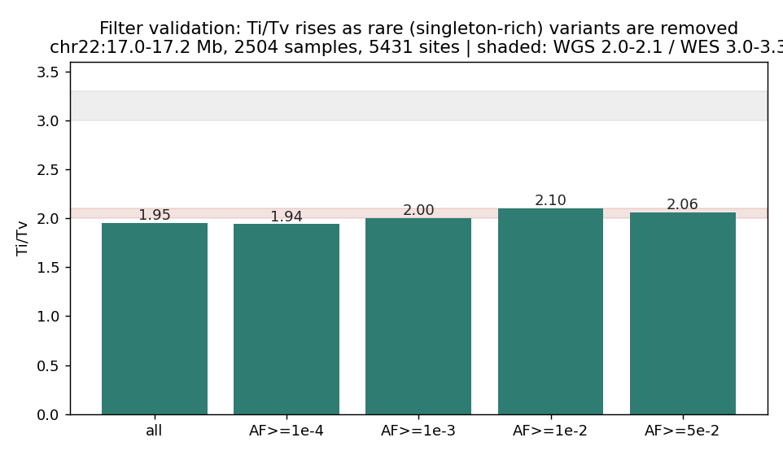
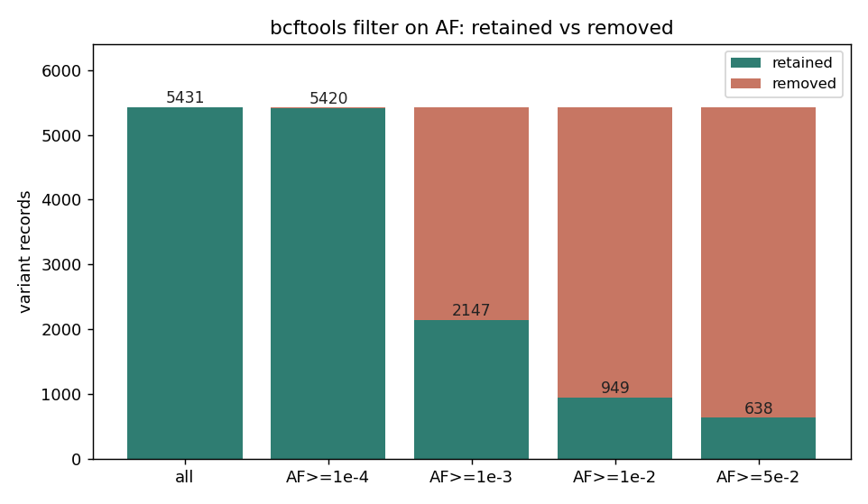

# 020 · bioSkills 真实试用：filtering-best-practices（变异过滤）

## 功能定位与适用范围

`filtering-best-practices` 讲解**变异 callset 的过滤**：在位点层面（site-level）与基因型层面（genotype-level）分别剔除低质量信号。

- **适用**：决定用 VQSR / 硬过滤 / ML 重校准；设 SNP 与 indel 各自的阈值；基因型级 GQ/DP 过滤；用 Ti/Tv 与 het/hom 验证过滤效果；体细胞用 FilterMutectCalls。
- **不适用**：VCF 规范化（见 variant-normalization）；汇总统计（见 vcf-statistics）。

核心原则：过滤决定的是「保留哪一类错误」，而不是「有没有错误」。VQSR（学习式高斯混合）在小样本/外显子上会崩；静态硬阈值在大规模上会丢真变异。两条硬规则：① 位点过滤与基因型过滤正交，且**位点优先**；② SNP 与 indel 错误机制不同，**必须分开过滤后再合并**。

## 属性表（本次真跑环境）

| 项 | 值 |
|---|---|
| 数据源 | 1000 Genomes Phase3 chr22（GRCh37 / hs37d5），切片 17.0–17.2 Mb |
| 样本数 / 记录数 | 2504 / 5431（SNP 5114，indel 319） |
| 工具 | bcftools 1.24 |
| 可用注释 | QUAL（全为 100）、INFO/AC、AN、AF、DP、VT；无 QD/FS/MQ/SOR，无 FORMAT/GQ/DP |
| 实验产物 | `content/素材/variant-calling/020-filtering/` |

## 成分拆解

### 1. 方法选择

| 方法 | 适用 | 失效场景 |
|---|---|---|
| 硬过滤（VariantFiltration） | 单样本、外显子、panel、非模式生物、无 truth 资源 | 大规模精度敏感场景 |
| VQSR | 人类、单个深 WGS **或** ~30+ 联合外显子，配 HapMap/Omni/Mills | 单个外显子/panel：GMM 不可识别，VQSLOD 是噪声 |
| VETS（ScoreVariantAnnotations，BETA） | VQSR 的现代替代，隔离森林，可下探到更小队列 | 仍为 BETA |
| NVScoreVariants | 单样本（尤其单外显子/panel），PyTorch CNN | 需 GPU 友好环境 |
| DeepVariant/DRAGEN 输出 | 自带已校准字段 | **不要再叠加 GATK 硬过滤** |

### 2. 位点过滤 vs 基因型过滤（顺序不可颠倒）

位点过滤判断「这个位点是否真实」；基因型过滤把不可信的**单个样本基因型**置为 `./.`。顺序：位点过滤 → 基因型过滤 → 重算队列 QC。若先算 HWE/缺失率，低 GQ 的垃圾基因型会制造伪偏离。

基因型过滤常规：GQ < 20 → `./.`；DP < 8–10 → `./.`；杂合子 allele balance 远离 0.5（如 <0.2 或 >0.8）→ 怀疑比对假象/拷贝数/污染。

### 3. hom-alt 位点的「缺失值按通过处理」规则

MQRankSum、ReadPosRankSum、BaseQRankSum 是 ref 读 vs alt 读的秩和检验，**只在杂合位点有定义**；纯合 alt 位点没有 ref 读，该注释为缺失（`.`）。GATK VariantFiltration 只在值**存在且违规**时才触发过滤——缺失值通过。手写 bcftools 等价逻辑时必须显式加守卫：`(INFO/MQRankSum >= -12.5 || INFO/MQRankSum = ".")`，否则**所有纯合 alt 位点会被静默删光**。

### 4. 软过滤 vs 硬过滤

`-e` 排除、`-i` 保留；`-s NAME` 写 FILTER 标签而不删除（软）；末端 `bcftools view -f PASS` 提取存活者。软过滤保留可追溯性，推荐在交付前使用。

### 5. 按类型分过滤

SNP 与 indel 阈值不同是有原因的：真实 indel 在重复区比对更乱，FS 放宽到 200；假 indel 聚集在读段末端，ReadPosRankSum 收紧到 -20；indel 上 MQ/MQRankSum 诊断力弱故直接弃用。

## 严格复现（本次真跑）

完整命令与输出见 `repro_transcript.txt`。

**① 整合集的 QUAL / FILTER 无过滤信号（重要实测）**

- `QUAL` 唯一值数量 = **1**（全部位点均为 100）。
- `FILTER` 5431 条全部为 `PASS`。

这是 1000G Phase3 整合集的特征：QUAL 是上游合并后的统一占位值，**对该 callset 做 `QUAL >= 30` 之类的过滤不会产生任何筛选效果**。真实项目里若拿到这类文件，位点质量过滤必须依赖 DP/AF/类型等其他维度。

**② 软过滤 vs 硬过滤（按 AF）**

- `bcftools filter -s LowAF -e 'INFO/AF < 0.01'` → 4492 条被打上 `LowAF` 标签（记录仍在文件中）。
- `bcftools view -f PASS` → 保留 939 条。
- `bcftools filter -e 'INFO/AF < 0.01'`（硬过滤，直接删）→ 保留 939 条。
- 二者保留数一致，差异在于软过滤保留了 FILTER 标签、可审计可回溯。

**③ 按类型拆分**

- `-v snps` → 5114 条；`-v indels` → 319 条。验证了「分开过滤」的可操作入口。

**④ 用 Ti/Tv 验证过滤效果（本章最有信号的实测）**

| 过滤条件 | 保留记录 | Ti/Tv |
|---|---|---|
| 全部（无过滤） | 5431 | 1.95 |
| `AF >= 1e-4` | 5420 | 1.94 |
| `AF >= 1e-3` | 2147 | 2.00 |
| `AF >= 1e-2` | 949 | **2.10** |
| `AF >= 5e-2` | 638 | 2.06 |

随稀有变异（singleton 富集）被剔除，Ti/Tv 由 1.95 上升到 2.10，进入 WGS 期望带（2.0–2.1）。这与 018 测得的 singleton Ti/Tv≈1.85 一致：**低频变异本身拉低 Ti/Tv**，因为随机错误的 Ti/Tv≈0.5。反面用法：若某次过滤后 Ti/Tv **下降**，说明过滤器正在优先删除真实的转换。

**⑤ 极端深度窗口（有限效果）**

- `INFO/DP` 分位数：p05 = 8999，中位数 = 17852，p95 = 23297。
- 施加中位数的 0.3x–2x 窗口（5355–35704）后保留 5356 条（仅丢弃 75 条），Ti/Tv 保持 1.95。
- 说明：此处的 `INFO/DP` 是 **2504 样本的汇总深度**，分布集中，不等于单样本深度；按文档建议，单样本层面的极端深度过滤才用于识别重复区塌陷。

## 未覆盖（诚实标注）

本数据集不含下列字段/资源，故未做真跑，仅记录文档口径：

- GATK VQSR / VETS / NVScoreVariants：需 GATK 与 HapMap/Omni/Mills truth 资源，本环境无。
- QD / FS / MQ / MQRankSum / ReadPosRankSum / SOR 硬过滤：本 VCF 不含这些注释。
- hom-alt「缺失即 PASS」守卫的真跑验证：需含 RankSum 注释的 callset。对应 bcftools 写法已在上文给出。
- 基因型级 GQ/DP 过滤：本 VCF 无 `FORMAT/GQ`、`FORMAT/DP`。

### 本次出图

## 实践要点

- **先判断 callset 有没有过滤信号**：若 QUAL 被统一占位（如全 100），位点质量过滤需换维度（DP/AF/类型）。
- **SNP 与 indel 分开过滤**，阈值不同是有机制原因的，不是文档不一致。
- **任何 RankSum 项都要加 `|| = "."` 守卫**，否则纯合 alt 位点被静默清空。
- **过滤后必须回看 Ti/Tv 与 het/hom**：改善一项而劣化另一项说明校准错误。
- **DeepVariant / DRAGEN 输出不要再叠加 GATK 硬过滤**，其 QUAL 已校准且注释分布不同。
- **优先软过滤（`-s`）**，保留 FILTER 标签以便回溯与复核。

## 小结

filtering-best-practices 的价值在于「按数据规模选方法 + 位点/基因型两层分离 + 过滤后验证」。本次用 2504 样本真实数据完成：软/硬过滤对比、类型拆分、Ti/Tv 验证（1.95→2.10）、极端深度窗口测试，并实测到一个易被忽略的前提——整合集的 QUAL 可能完全没有筛选能力。

（数据与可复现脚本见 `content/素材/variant-calling/020-filtering/`，含 `make_figs.py`、`repro_transcript.txt` 及两张图。）
