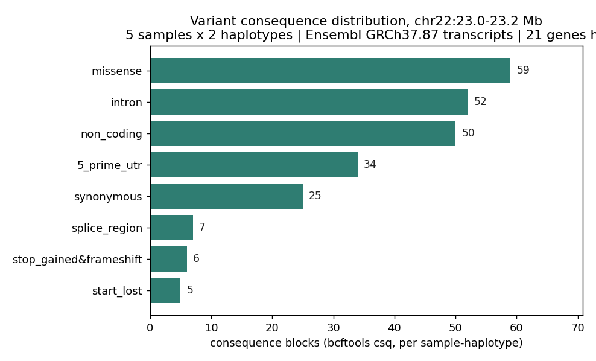
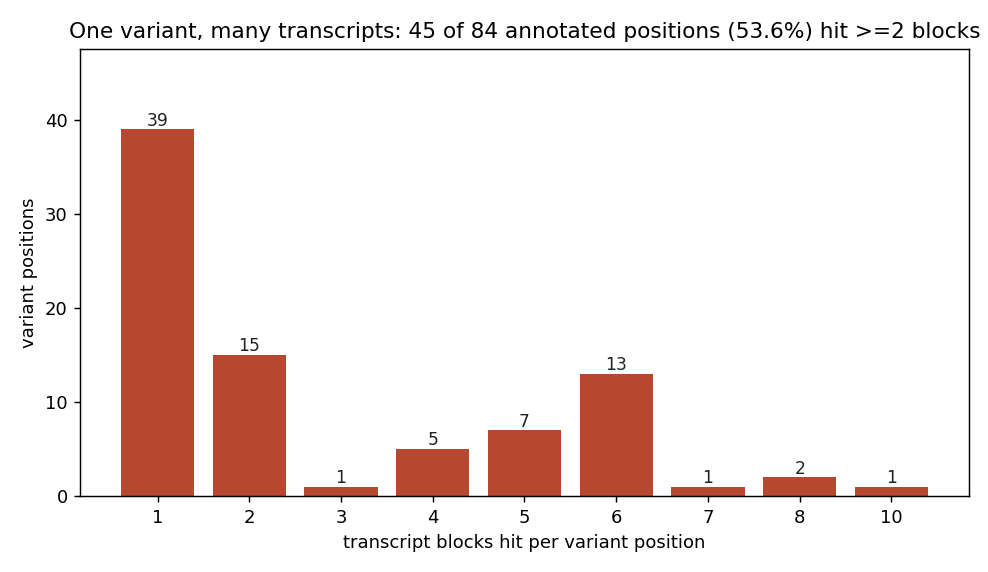

# 021 · bioSkills 真实试用：variant-annotation（变异功能注释）

## 功能定位与适用范围

`variant-annotation` 讲解给 VCF 变异挂载**功能后果（consequence）、群体频率、致病性预测**的方法与选择依据。

- **适用**：选注释引擎与版本固定；选报告用的转录本集（RefSeq / Ensembl / MANE Select）；处理 HGVS 3' 移位与 VCF 左对齐的冲突；判断后果 + NMD 状态是否支撑 PVS1；选择单一已校准的预测因子（REVEL / AlphaMissense / SpliceAI）；用 gnomAD grpmax 过滤等位频率（FAF）而非全局 AF。
- **不适用**：ACMG 合并规则与最终分类（见 clinical-interpretation）。

## 属性表（本次真跑环境）

| 项 | 值 |
|---|---|
| 数据源 | 1000 Genomes Phase3 chr22（GRCh37 / hs37d5） |
| 注释区 | 22:23.0–23.2 Mb（基因密集区，GFF3 内 200 kb 窗口中基因数最高 = 27） |
| 样本 | 子集 5 个（HG00096 / HG00097 / HG00100 / HG00101 / HG00102） |
| 引擎 | **bcftools csq 1.24**（轻量后果预测，非 VEP/SnpEff） |
| 转录本模型 | Ensembl GRCh37.87 chr22 GFF3（700 gene / 1827 mRNA / 15863 CDS） |
| 参考 | hs37d5（远程 range 提取，避免本地切片坐标错位） |
| 产物 | `content/素材/variant-calling/021-annotation/` |

## 成分拆解

### 1. 治理原则：注释不是确定性的

一个变异的后果不是变异本身的属性，而是 **（变异，转录本模型，引擎，引擎版本，参数集）** 这个元组的属性。改变任一元素，报告的后果、HGVS 字符串、乃至下游 PVS1 资格都会变。

因此关键决策不是「找对工具」，而是**钉死每一个轴并记录在报告上**：基因组版本、转录本集、引擎+版本、预测因子+版本、gnomAD 版本。可复现性来自「钉住」而非「挑对」。永远不要拿 RefSeq 注释的变异去和 Ensembl 注释的变异直接比较。

三个独立的非确定性轴：转录本**集合**（RefSeq / Ensembl-GENCODE / MANE）、转录本**选择启发式**（canonical / worst-consequence / `--pick` / MANE Select）、**引擎本身**（VEP/SnpEff/ANNOVAR 的剪接区宽度、上下游窗口、HGVS 移位规则、严重度排序各不相同）。不一致集中在 indel、剪接区、多转录本基因；驱动 PVS1 的 LOF 调用恰是各引擎一致性最差的一类。

### 2. 注释前必须规范化，且不要从 POS 手工推 HGVS

`bcftools norm -f reference.fa -m-any` 把多等位拆成二等位，使每个 ALT 获得独立注释。

HGVS 3' 规则与 VCF 左对齐存在**真实且仍活跃**的冲突：VCF 规范化要求 indel **左对齐**（Tan 2015）；HGVS 要求**相反**——把重复区中的 indel 放到相对转录本最 3' 的位置。对正链基因，转录本 3' 方向是基因组最右端，与左对齐相反；负链基因上二者可能因链的方向而偶然重合。净效果：**同一个 indel，正确的 VCF 左对齐坐标与正确的 HGVS c. 字符串可能指向不同的重复单元**。因此：依靠引擎生成 HGVS（VEP 会做转录本 3' 移位），不要手工推导；把患者变异与 ClinVar/文献 HGVS 匹配时，先把两边规范化到同一表示。

### 3. 转录本集选择

| 集合 | 说明 | 何时用于报告 |
|---|---|---|
| MANE Select | 每基因一条转录本，GRCh38 上 `NM_`/`ENST` 逐字节一致 | 临床报告默认（唯一跨库稳定的 c./p.） |
| MANE Plus Clinical | MANE Select 漏掉已知致病变异时的额外异构体 | 与 MANE Select 并列 |
| RefSeq (`NM_`/`NR_`) | NCBI 策展，多数 ClinVar/HGMD 文献 c. 用此 | 遗留临床固定版本 |
| Ensembl/GENCODE (`ENST`) | 全面、与基因组对齐，每基因转录本更多 | 研究用；与 RefSeq 非 1:1，c. 坐标不同 |
| worst-consequence（跨全部） | 所有重叠转录本中最严重者 | 仅发现阶段——会夸大严重度、制造假 PVS1 |

决策：在 MANE Select（+ Plus Clinical）上报告，**不要**用 worst-consequence。worst-consequence 会把一个次要非表达异构体上的经典剪接改变报成「splice」，而 MANE Select 上其实是内含子——制造出假的 PVS1 候选。Ensembl 的「canonical」转录本**经常不是** MANE Select，迁移到 MANE 会改变部分 c. 坐标（这是预期，不是错误）。MANE 仅存在于 GRCh38；GRCh37 流程须 liftover 或自行维护每基因转录本钉死列表。

### 4. 为什么 `--pick` 对临床是危险的

VEP 默认报告所有重叠转录本的全部后果。`--pick` 用一组有序启发式把每个变异压成一块，默认顺序是 canonical → biotype → consequence rank → **转录本长度 → 最后 accession 顺序**。后两级 tiebreaker 没有临床依据：并列时可能由转录本长度或 `ENST` 的字母数字顺序决定患者拿到哪个后果；且它是**按变异**挑的，同一基因内变异 A 与变异 B 可能落在**不同转录本**上，破坏坐标一致性；还可能把 PVS1 合格的后果藏在良性后果之后。

可辩护的配置：钉住 MANE Select（+ Plus Clinical），或钉住实验室验证过的每基因列表。若确需 `--pick` 式归并，必须约束顺序使 MANE 优先、长度/accession 永不决定：

```bash
vep -i norm.vcf --vcf --cache --offline --assembly GRCh38 \
    --mane_select --pick --pick_order mane_select,canonical,biotype,rank -o out.vcf
```

**本次实测为这条规则提供了数据支撑**：在基因密集区，84 个得到注释的位点中有 **45 个（53.6%）命中 ≥2 个转录本块**（最多的 1 个位点命中 10 块）。多转录本歧义是常态而非例外，转录本选择必须被显式钉死。

### 5. 后果、影响分档与 NMD（PVS1 的铰链）

把词汇锚定到 Sequence Ontology（SO）术语（`missense_variant`、`stop_gained`、`frameshift_variant`、`splice_donor_variant`、`splice_acceptor_variant`、`start_lost`、`stop_lost`、`inframe_deletion`、`synonymous_variant`……）。SnpEff/ANNOVAR 映射到大致等价的术语，但在剪接区宽度和更细的内含子术语上有差异，跨引擎做术语级匹配不可行。

**影响分档不是证据。** SnpEff 的 `HIGH/MODERATE/LOW/MODIFIER` 与 ANNOVAR 的 `exonic;splicing` 只是分流便利。`HIGH` 把 `stop_gained`、`frameshift`、经典剪接混在一起，而其中任一项是否够格 PVS1 取决于 NMD、外显子位置、基因的 LOF 机制——分档对此一无所知。把「HIGH impact」当作「PVS1 达成」是典型错误。

**NMD 50-nt / 末外显子规则**决定 PVS1 强度：提前终止密码子（PTC）位于最后一个外显子-外显子连接处上游 **>~50-55 nt** 会触发无义介导衰变 → 无蛋白 → 强 LOF。位于**最后一个外显子**、或距最终连接处 **~50 nt 以内**的 PTC **逃逸 NMD**——截短蛋白仍会生成，以「NMD→无蛋白」逻辑给足强度 PVS1 不成立（按丢失了多少蛋白/哪些结构域降级为 Strong/Moderate/Supporting）。单外显子基因没有连接处，无义变异按构造逃逸 NMD；靠近起始端的 PTC 可能下游重起始。PVS1 还要求 LOF 是该基因**已确立的致病机制**——在功能获得/显性负效基因里的 null 不得触发 PVS1。

### 6. 预测因子：每类证据用一个已校准的工具

该领域存在两个结构性问题：（1）**循环性**——多数预测因子在 ClinVar/HGMD 标签上训练，用同一批库做基准或 ACMG 校准部分是自指的；（2）**相互吞并**——REVEL 是 13 个分量分数（含 SIFT、PolyPhen）的随机森林，所以「REVEL 与 PolyPhen 一致」不是独立佐证，PolyPhen 就在 REVEL 内部。ACMG 计分系统的承重假设是证据线之间独立，堆叠相关预测因子会静默过度判病。

因此：**每类证据（错义；剪接）只用且仅用一个已校准的工具**，并按其校准强度使用。

| 预测因子 | 范围 | 用于 PP3/BP4 |
|---|---|---|
| REVEL | 罕见错义 | 校准最好的单一错义工具；PP3_Supporting ≥ 0.644，BP4_Supporting ≤ 0.290（Pejaver 2022 复现良好的值） |
| AlphaMissense | 错义，蛋白质组范围 | 未在 ClinVar 标签上训练；须用当前 ClinGen SVI 校准阈值，而非开发者分级切点 |
| CADD | 全变异类型 | 用于全基因组/非编码排序，**不是错义 PP3** |
| SIFT / PolyPhen-2 | 错义 | 不可单独作为证据——校准中未达 Supporting，且是 REVEL 的组成部分 |
| SpliceAI | 剪接改变 | 剪接预测器；四个 delta 取最大值；0.2 高召回 / 0.5 推荐 / 0.8 高精度 |

**SIFT/PolyPhen 单独已近乎无效**：ClinGen SVI 校准中两者都未达到 Supporting 强度，且把很大比例错义判为「damaging」（在罕见变异上阳性预测值低）；它们是 REVEL 的组件，与 REVEL 并列引用属于重复计数。**CADD ≥ 20 不是「致病」**：原始 CADD 未达 PP3 的 Supporting，而开发者推荐的 CADD ≥ 20 在校准中映射到**良性** Moderate——与通常用法恰好相反。

SpliceAI 注意事项：确认流程用的是 masked 还是 raw 模型；默认打分窗口 ±50 bp，深部内含子/假外显子效应需要放宽窗口（至 ±10 kb）否则漏检；delta 是预测值，转成 PS3/PP3 强度需要 ClinGen 剪接校准；它**不报告结果**（外显子跳跃 vs 内含子滞留），而这才是决定 PVS1 适用性的东西。

### 7. 群体频率：用 grpmax 过滤 AF，不是全局截断

gnomAD 版本+构建本身即是变量：v2.1.1 是 GRCh37（141,456 个体）；v3 仅基因组且为 GRCh38；v4 为 GRCh38（约 730k 外显子 + 约 76k 基因组）。跨版本比较 AF 需要对**变异**（不只是坐标）做 liftover，indel/segdup 可能错配。「缺失」可能意味着「此处不可 call」，不等于「人类中不存在」——必须查位点覆盖度/可 call 性与 PASS/`AS_FilterStatus` 标记。

单一的全局 AF 截断（「AF > 1% → 良性」）双向都错。真正致病等位的最大可信群体 AF 是**按疾病**的，取决于患病率、等位与遗传异质性、遗传方式、外显率（Whiffin 2017）。应使用**过滤等位频率 FAF**：grpmax（各遗传祖先组中最高的 AF，旧称 popmax）AF 的 **95% CI 下界**——gnomAD v4 中为 `fafmax_faf95_max`（外显子+基因组联合 VCF 中为 `fafmax_faf95_max_joint`）。全局 AF 会把某一祖先中常见的变异在整个队列中稀释掉，grpmax 则暴露它；取 CI 下界可防范小子群估计的噪声。规则：FAF 超过该疾病的最大可信 AF 时应用 BA1/BS1。

## 严格复现（本次真跑）

完整命令与输出见 `repro_transcript.txt`。

**① 准备注释资源**（本机无 VEP 缓存，改用轻量引擎）

- 下载 Ensembl GRCh37.87 chr22 GFF3（868 KB，700 gene / 1827 mRNA / 15863 CDS）。
- GFF3 **未按坐标排序**，`tabix` 直接建索引会报 `Unsorted positions on sequence #1: 16124742 followed by 16122671`。修正：保留 `##` 头、按 (seqid, start) 排序后再 `bgzip` + `tabix -p gff`。
- `bcftools csq` 报告：`Indexed 4459 transcripts, 27134 exons, 15863 CDSs, 6356 UTRs`。

**② 选择注释区段**（第一次选址信号不足，主动换区）

- 先在 17.0–17.2 Mb 试跑：5471 条记录 → 仅 290 个位点得到后果、涉及 12 个基因，其中 1476/1497 的后果块为 `non_coding`。该区段基因稀疏，演示价值低。
- 改为从 GFF3 中计算基因密度，取 **200 kb 窗口中基因数最高**的区段（23.0–23.2 Mb，27 个基因），远程提取并重跑。

**③ 注释前规范化**

- `bcftools norm -m-any -f hs37d5`：8143 → 8261 条（split 111、realigned 10）。

**④ csq 后果注释结果（区段 23.0–23.2 Mb，5 样本）**

| 后果类型 | 块数 |
|---|---|
| missense | 59 |
| intron | 52 |
| non_coding | 50 |
| 5_prime_utr | 34 |
| synonymous | 25 |
| splice_region | 7 |
| stop_gained&frameshift | 6 |
| start_lost | 5 |

- 涉及 **21 个基因**、**84 个唯一位点**。
- **输出粒度须注意**：`bcftools csq -O t` 按 **(样本, 单倍型)** 输出结果行。子集到 5 样本后，只有这些样本单倍型上携带的变异会产生后果块，因此「块数」不等于「位点数」，且随样本子集变化。各样本块数：HG00097 62、HG00102 73、HG00096 49、HG00097…（完整分布见 transcript）。

**⑤ 多转录本歧义（支撑「钉死转录本集」）**

| 每位点命中的转录本块数 | 位点数 |
|---|---|
| 1 | 39 |
| 2 | 15 |
| 3 | 1 |
| 4 | 5 |
| 5 | 7 |
| 6 | 13 |
| 7 | 1 |
| 8 | 2 |
| 10 | 1 |

84 个位点中 **45 个（53.6%）命中 ≥2 个转录本块**，最多一个位点命中 10 块。这是「报告口径必须固定转录本集、`--pick` 默认启发式不可用于临床」的直接数据依据。

## 未覆盖（诚实标注）

- **VEP / SnpEff / ANNOVAR**：需下载引擎与注释缓存（VEP GRCh37/38 cache 数 GB），本环境未安装；本次以 `bcftools csq` 作为轻量替代完成真实后果注释。
- **MANE Select / Plus Clinical**：仅存在于 GRCh38；本数据为 GRCh37，无法演示 `--mane_select` 与 `--pick_order`。
- **预测因子插件**（REVEL / AlphaMissense / SpliceAI / dbNSFP）：需下载大规模插件数据库，未做真跑；上文阈值与校准结论均引自 Pejaver 2022、Cheng 2023、Jaganathan 2019。
- **gnomAD grpmax FAF 字段**：本 VCF 无 `fafmax_faf95_max`；仅记录字段口径与用法。
- **HGVS 3' 移位与左对齐冲突的实测**：需含重复区 indel 且带转录本注释的样例，本次未构造。

### 本次出图





## 实践要点

- **可复现性来自钉住轴**：记录构建版本、转录本集、引擎+版本、预测因子+版本、gnomAD 版本。
- **注释前必须规范化**；不要从 POS 手工推导 HGVS，交给引擎做转录本 3' 移位。
- **报告用 MANE Select（+ Plus Clinical），不用 worst-consequence**；`--pick` 必须配 `--pick_order mane_select,...` 约束。
- **影响分档不是证据**；PVS1 要看 NMD 50-nt/末外显子规则与基因的 LOF 机制。
- **每类证据只用一个已校准预测因子**；SIFT/PolyPhen 单独无效且与 REVEL 重复计数；CADD ≥ 20 不是致病。
- **用 grpmax FAF 而非全局 AF**；「在 gnomAD 里出现」不等于良性（隐性携带者、迟发/低外显率、克隆造血污染、区域伪影）。

## 小结

variant-annotation 的核心不是「选哪个工具」，而是**把注释的每一个非确定性轴钉死并记录下来**。本次用 bcftools csq 在真实 GRCh37 数据上完成后果注释，实测到两个有说服力的现象：注释覆盖高度依赖区段基因密度（稀疏区 290/5471 且 98.6% 为 non_coding vs 密集区 21 基因、后果类型多样），以及 **53.6% 的已注释位点存在多转录本歧义**——后者正是「转录本集必须显式钉死」的量化依据。

（数据与可复现脚本见 `content/素材/variant-calling/021-annotation/`，含 `make_figs.py`、`csq_blocks.tsv`、`repro_transcript.txt` 及两张图。）
