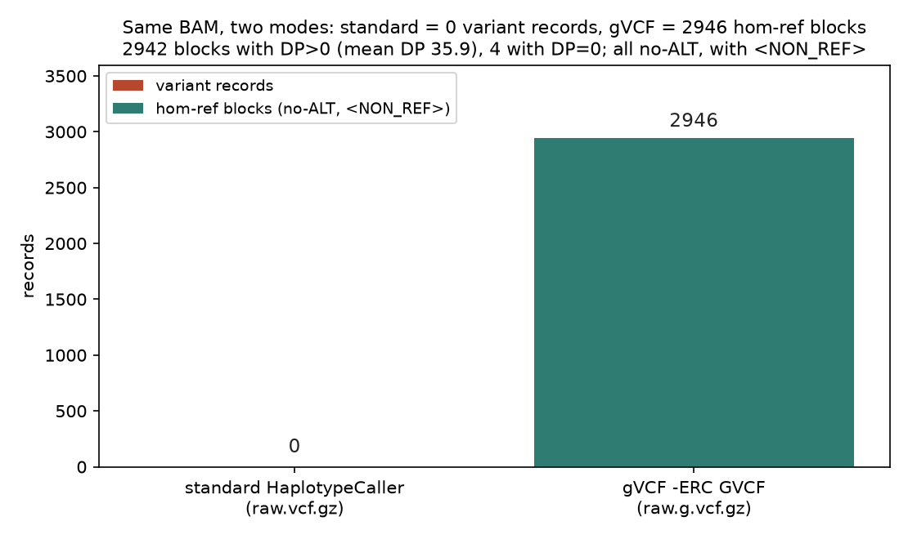
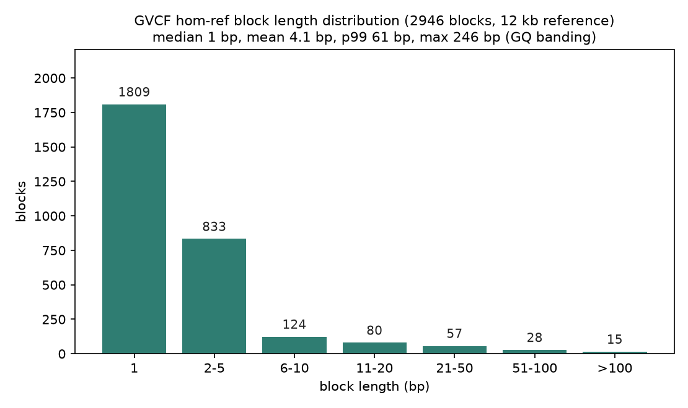
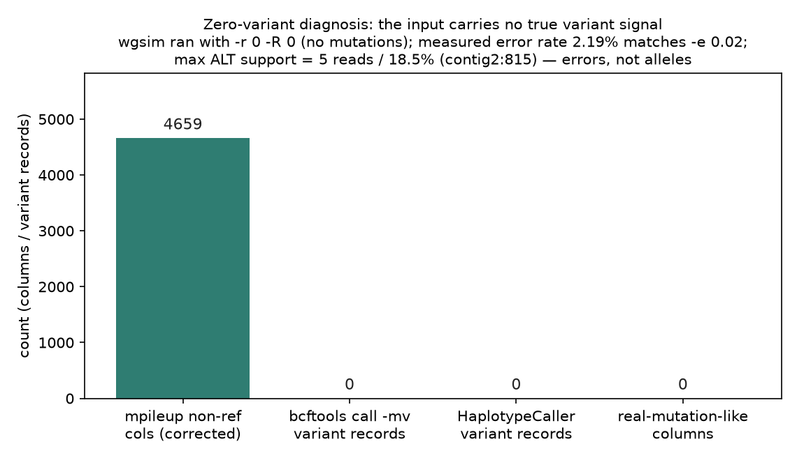

# 022 · bioSkills 真实试用：gatk-variant-calling（GATK 变异检测）

## 功能定位与适用范围

`gatk-variant-calling` 讲解**用 GATK HaplotypeCaller 检测胚系 SNP 与 indel，以及 GVCF 联合基因型工作流**。

- **适用**：决定用 HaplotypeCaller 还是 pileup/DRAGEN 调用器；判断 BQSR 是否还有价值；是否为队列逐样本产出 GVCF；处理非二倍体、线粒体、性染色体、污染样本。
- **不适用**：调用后的过滤深度（见 filtering-best-practices）；队列联合基因型的规模化（见 joint-calling）。

## 属性表（本次真跑环境）

| 项 | 值 |
|---|---|
| GATK | v4.6.2.0（HTSJDK 4.2.0 / Picard 3.4.0 / OpenJDK 17.0.18-internal） |
| 安装方式 | conda env `bio-gatk`，bioconda + conda-forge 通道（WSL Ubuntu） |
| 比对数据 | `aligned_e2e.bam`：4 contig × 3000 bp 合成参考，5954/6000 reads mapped（99.23%），50× 量级覆盖 |
| reads 来源 | `wgsim -N 3000 -1 100 -2 100 -e 0.02 -r 0 -R 0 -X 0 -S 42`（零真实突变，仅 2% 测序错误） |
| 主产出 | `raw.vcf.gz`（0 条变异）/ `raw.g.vcf.gz`（2946 条 hom-ref 区块） |
| 实验产物 | `content/素材/variant-calling/022-gatk-variant-calling/` |

## 成分拆解

### 1. 为什么用 HaplotypeCaller 而不是 pileup 调用器

pileup/基于位置的调用器（bcftools mpileup、旧 UnifiedGenotyper）**独立地对对齐的每一列做基因型判定**，信任比对器对每条读段的放置。在 indel 与成簇变异附近，这种放置是**每条读段各自的贪心最优**，而不是位点一致的——同一个 indel 在不同读段中被（错误地）放到不同位置，因此被系统性误表示。

HaplotypeCaller（HC）丢弃局部对齐并重新推导：在任何有信号的区域执行**局部 de-novo 组装**候选单倍型，然后把每条读段重新比对到这些单倍型上。indel 于是**只被表示一次**，在一个组装好的单倍型里，而不是在每条读段里各自表示。这就是 HC（以及 DRAGEN、DeepVariant）在 indel 与复杂位点上胜过 pileup 调用器的原因，也是 HC 成为其他一切工具基准参照的原因。

### 2. HaplotypeCaller 的工作机制（与决策相关的部分）

1. **活性区域判定。** HC 计算每位点的活性分数（pileup 上参考 vs 非参考基因型似然的快速对比），用高斯核平滑，再按阈值（`--active-probability-threshold`，默认 0.002）播种活性区域，并做填充使组装器能看到侧翼参考。非活性碱基在 GVCF 模式下仍会得到参考置信度输出。病态高深度或高度重复区域可能组装失败——那正是 DeepVariant/DRAGEN 领先的地方。
2. **局部组装。** HC 用参考序列与重叠读段的 k-mer 构建类 de Bruijn 图（默认 k = 10 与 25，合并），剪掉低权重（错误）边，枚举支持最好的单倍型。每个单倍型再经 Smith-Waterman 重比对到参考，把组装出的序列翻译成具体的 SNP/indel 事件。
3. **PairHMM 读段-单倍型似然。** 对每一个（读段, 单倍型）对，HC 用配对隐马尔可夫模型计算 P(读段 | 单倍型)，该模型**对全部比对方式做积分**（前向算法），而非只取最优的一条——这是在对齐本身不确定时加权支持度的统计正确做法。它是主要的计算开销；生产运行通过 `--pair-hmm-implementation` 与 `--native-pair-hmm-threads` 使用向量化（AVX/AVX-512）内核。DRAGEN 把同一内核搬到 FPGA 上。
4. **基因型似然。** 单倍型似然被边缘化为等位似然，再在假定倍性下按贝叶斯 DePristo/GATK 模型计算基因型似然（PLs），输出 GT/AD/DP/GQ/PL 以及位点注释（QD、FS、MQ、MQRankSum、ReadPosRankSum、SOR）。
5. **二倍体假定。** 基因分型默认二倍体（`--sample-ploidy 2`），这把真实等位硬编码为 0、0.5 或 1.0 三种比例。任何违反该假定的情况（混合样本、多倍体、CNV、嵌合、半合子 chrX/Y）都需要显式的 `--sample-ploidy` 或体细胞调用器。

### 3. 流程决策树

```
分析上下文是什么？
├── 单样本，想要 DRAGEN 级精度且开源 -> HaplotypeCaller --dragen-mode（按 QUAL 硬过滤）
├── 队列 < ~2000，人类 -> 逐样本 -ERC GVCF -> 联合基因型 -> VQSR/VETS（见 joint-calling）
├── 队列 > ~2000，人类 -> ReblockGVCF + GnarlyGenotyper，或 DeepVariant + GLnexus
├── 非人类 / 非模式生物 -> 硬过滤（无 VQSR 训练资源）
├── 靶向 panel / 小外显子 -> 硬过滤（变异太少，VQSR 不可行）
├── 非二倍体 / 混合 / 性染色体 / 线粒体 -> 设 --sample-ploidy 或用 Mutect2
└── 体细胞 / 嵌合 -> Mutect2（不是 HaplotypeCaller）
```

所有模式在调用前都需要 MarkDuplicates。BQSR 是否前置则是一个真实的决策。

### 4. GVCF 参考置信度模型（`-ERC GVCF`）

`-ERC GVCF` 在**每一个位置**（变异与非变异）记录该位点为纯合参考的置信度。两个性质使它成为可扩展队列调用的骨架：

- **符号等位 `<NON_REF>`。** 每条记录都带一个符号 ALT `<NON_REF>`（「任何尚未观测到的等位」），并针对它计算 AD/PL。在联合基因型阶段，即使本样本看起来是参考，**在别的样本中发现的变异也可以在本样本中被评估**——针对 `<NON_REF>` 的证据提供了这种可能。这正是逐样本 GVCF 能与队列中后续发现的等位前向兼容的原因，也是联合基因型能区分「确证纯合参考」与「无数据」（把参差的基因型矩阵「平方化」）的原因。
- **GQ 分带。** 连续且 GQ 相近的非变异位点会折叠成 homRef 区块，因此 GVCF 不是每碱基一行。`-ERC BP_RESOLUTION` 关闭分带（每碱基一行，文件更大）。

**N+1 问题**：朴素的联合调用在队列变化时重新处理全部 N 个样本；GVCF 把昂贵的组装/似然工作**每样本只做一次**，因此加入第 N+1 个样本只需生成那一个 GVCF 并重跑廉价的合并 + GenotypeGVCFs。

### 5. BQSR、DRAGSTR 与 DRAGEN-GATK 模式

**BQSR 是否还值它的位置（诚实地讲：未有定论）。** BaseRecalibrator/ApplyBQSR 在碱基 call 协变量（报告质量、读段组、cycle、序列上下文）上建立经验错误模型，以校正系统性的、仪器特有的失校准。在较老的连续质量值四色仪器（HiSeq、MiSeq）上它确实有用。在现代二色化学（NovaSeq/NextSeq）上，质量值只以约 4 个粗分箱发出，几乎没有平滑结构可重校准；经验上做与不做 BQSR 的 callset 大体不变，差异集中在边缘 GQ 的位点。Broad 出于流程一致性把 BQSR 保留在 Best Practices 中；若干大型流程在分箱数据上弃用它。应视为调用器/仪器相关，而非必须——不存在普适的共识建议。

**indel 精度杠杆真正移动的地方：DRAGSTR。** indel 错误随串联重复上下文变化，所以更大的收益来自 STR 感知的 indel 建模，而非碱基质量重校准。DRAGEN-GATK 加入了 **DRAGSTR**：一个逐样本自校准流程（`CalibrateDragstrModel` → `--dragstr-params-path`），把先验 indel 错误/变异概率建模为 STR 周期（重复单元长度）与长度（拷贝数）的函数，在基因分型前调整 PairHMM 的 indel gap 先验。

**`--dragen-mode`。** DRAGEN 是 Illumina 的 FPGA 加速比对-调用引擎（一个基因组约 20–25 分钟；在难以比对的 precisionFDA V2 区域胜出）。Illumina 与 Broad 共同开发了 **DRAGEN-GATK**，把 DRAGEN 的错误模型移植进开源 GATK，形成**功能等价**的流程（Regier 等 2018：当两个流程的调用差异小于测序重复之间的差异时，即功能等价）。`HaplotypeCaller --dragen-mode` 启用 DRAGSTR 加 **BQD**（碱基质量崩塌）与 **FRD**（外源读段检测），并**取代经典的 BQSR**——错误建模移到调用器内部。QUAL 已良好校准，因此按 QUAL 硬过滤即可，无需 VQSR。

```bash
gatk VariantFiltration -R reference.fa -V sample.vcf.gz -O sample.filtered.vcf.gz \
    --filter-expression "QUAL < 10.4139" --filter-name "DRAGENHardQUAL"
```

### 6. 等位特异注释（AS_）

标准注释（QD、FS、MQ…）把位点上所有读段混在一起统计，因此在多等位位点上，一个真实等位与一个错误驱动的等位共享同一个位点级通过/失败结论。**AS_ 注释**（在 GVCF 调用/基因分型时用 `-G AS_StandardAnnotation` 请求）按等位计算每个指标（AS_QD、AS_FS、AS_SOR、AS_MQ、AS_MQRankSum、AS_ReadPosRankSum），使 AS_VQSR（`-AS`）能独立过滤每个等位。收益随队列规模增长，因为「真实等位与伪影在同一位置碰撞」的多等位位点会随样本数增加而激增。

### 7. 边界情况

**倍性（`--sample-ploidy`）。** 基因型数量是多重集系数 C(倍性 + 等位 − 1, 倍性)，因此 PL 向量在倍性与等位计数两个维度上都会膨胀——这是高倍性与混合样本调用内存吃紧的原因。

| 情况 | 设置 | 原因 |
|---|---|---|
| 混合样本（n 个个体） | `--sample-ploidy 2n` | 估计等位计数而非个体基因型；二倍体会把中间频率压掉 |
| 多倍体生物 | `--sample-ploidy 4` 等 | 剂量基因型（AAAB=0.25、AABB=0.5）无法表示为杂合 |
| 46,XY 样本的非 PAR chrX/Y | `--sample-ploidy 1`（或 `--ploidy-regions` BED） | 半合子；二倍体调用会从错误/旁系错配中产生不可能的「杂合」 |
| PAR1/PAR2 | 二倍体（屏蔽 Y 上的 PAR，X-PAR 按二倍体调用） | PAR 会发生重组，两种性别中都是二倍体 |

**线粒体要用 Mutect2，不是 HaplotypeCaller。** mtDNA 异质性是连续的 VAF（在数学上等同于亚克隆体细胞变异），二倍体基因型模型无法表达，因此要用体细胞调用器。用 `gatk Mutect2 --mitochondria-mode`（提高低 AF 灵敏度）。由于 rCRS（NC_012920.1，16,569 bp 环状）在控制区被线性化，需要比对两次——对标准参考，以及对一个平移约 8,000 bp 的参考（`ShiftFasta`，把人为断点移出 D-loop）——在平移后的参考上调用控制区变异，再用 `LiftoverVcf` 转回来并合并。NUMT 来源的读段会 inflated 低异质性假调用，因此不信任约 5% AF 以下的调用。

**污染是信任任何调用之前的门闸。** 即使 1–3% 的跨样本污染也会注入少数等位，把等位平衡推离 0/0.5/1 足够远，从而被判为低比例杂合。先估计它：**VerifyBamID2**（祖先无关、无需基因型——通过 PCA/SVD 面板建模样本祖先，避免了 v1 的群体错配偏差），或 **CHARR**（只需 gVCF/VCF，从纯合 alt 位点的参考等位渗漏估计）。惯例：FREEMIX ≥ 0.03（3%）标记可能污染/互换的样本（是指导值，不是硬常数）。

## 严格复现（本次真跑，2026-09-03）

完整命令与输出见素材目录 `repro_transcript.txt`；环境创建、主流程、诊断各有落盘日志（`_setup_env.log` / `_run_gatk.log` / `_diag.log`）。

**评估史交代（诚实记录）**：2026-09-01 的评估稿称「GitHub release 不可达、拿不到 GATK jar、本机无 WSL，调用流程无法真跑」，据此只做了下游 VCF 核查。2026-09-03 环境已具备 WSL Ubuntu，经 bioconda 通道 `conda create -n bio-gatk -c bioconda -c conda-forge gatk4 openjdk=17` 一次成功，**原阻塞结论作废**。本节全部内容为当日真跑结果。

**① 主流程命令链（bio-gatk 环境）**

```
gatk CreateSequenceDictionary -R reference.fa -O reference.dict
samtools addreplacerg -r "@RG\tID:rg1\tSM:sample1\tPL:ILLUMINA\tLB:lib1" -o aligned_rg.bam aligned_e2e.bam
gatk HaplotypeCaller -R reference.fa -I aligned_rg.bam -O raw.vcf.gz --native-pair-hmm-threads 4
gatk HaplotypeCaller -R reference.fa -I aligned_rg.bam -ERC GVCF -O raw.g.vcf.gz --native-pair-hmm-threads 4
```

**② 标准模式产出 0 条变异，GVCF 模式产出 2946 条 hom-ref 区块（核心实测）**

| 模式 | 产出 | bcftools stats |
|---|---|---|
| 标准 HaplotypeCaller | `raw.vcf.gz`（3948 字节） | records = 0（SNPs 0 / indels 0） |
| `-ERC GVCF` | `raw.g.vcf.gz`（42219 字节） | records = 2946，no-ALT = 2946，每条含 `<NON_REF>` 符号等位 |

同一 BAM、同一参考、同一调用器，标准模式 0 条、GVCF 2946 条区块：这正是第 4 节参考置信度模型的实测体现——**无变异输入下，标准模式沉默，GVCF 对每个位置照样输出「这里是纯合参考」的置信度**（含 DP=0 的区块 4 个、DP>0 的区块 2942 个，覆盖均值 35.9）。

**③ 「0 变异」根因诊断（结论已验证，非推测）**

reads 由 011 的 `wgsim -N 3000 -1 100 -2 100 -e 0.02 -r 0 -R 0 -X 0 -S 42` 生成，`-r 0 -R 0` 意味着**模拟时零突变、零 indel**。四项独立验证：

| 验证项 | 结果 |
|---|---|
| 修正统计法 mpileup 非参考列（同时排除 `.` 与 `,`） | 4659 / 11962 列（38.9%）；原日志 11152 因未排除反向匹配逗号而虚高，作废 |
| 跨工具对照 `bcftools mpileup \| bcftools call -mv` | 0 条变异（与 HC 一致） |
| 真突变形态扫描（逐列） | 最高 ALT 支持 5 reads / 18.5%（contig2:815）；无任何列达「alt≥10 reads 且占比≥0.5」 |
| samtools stats 独立复核 | error rate = 2.19%（≈ `-e 0.02`），平均碱基质量 17.0，读长 100 bp |

诊断结论：参考与读段之间不存在真实突变，全基因组仅含散在的 2% 测序错误（任何单列的支持度都被错误率摊薄）。**HC 标准模式与 bcftools call 各自输出 0 条变异，是调用器对「无变异输入」的正确行为**——散在的随机错误不构成等位证据，这正是「局部组装 + 似然模型」区别于逐列数数的价值所在。

**④ GVCF 区块结构（第 4 节 GQ 分带的实测形态）**

解析 `raw.g.vcf.gz` 的 END 标签（2946 区块覆盖全部 12 kb 参考）：单碱基区块 1809 个，长度中位数 1 bp、均值 4.1 bp、p99 61 bp、最大 246 bp。区块极短的原因是本数据的碱基质量恒为 Q17，GQ 分带在同质低置信区间内难以折叠出长区块；即便如此，「不是每碱基一行」的压缩效应仍然存在（2946 区块 < 12000 碱基）。

### 本次出图







## 未覆盖（诚实标注）

本次真跑为单样本、单倍型纯净数据的最小闭环，以下部分仍未真跑，仅为文档口径：

- 变异阳性对照（`-r > 0` 或真实 BAM）下 HC 的 SNP/indel 召回与 QUAL 分布。
- `GenotypeGVCFs` 的 GQ/PL 重算与 `<NON_REF>` 消解（见 023 joint-calling）。
- BQSR（BaseRecalibrator/ApplyBQSR）、`CalibrateDragstrModel`、`--dragen-mode`。
- AS_ 注释与 AS_VQSR；线粒体双参考比对；性染色体/PAR 倍性处理；污染估计（VerifyBamID2/CHARR）。
- 并行化（按 contig 分散 + GatherVcfs）。

## 实践要点

- **输入信号先于工具怀疑**：调用器输出 0 条变异时，先用独立工具（bcftools call、mpileup 逐列支持度、samtools stats error rate）核查输入是否真的含变异信号，再谈参数——本次实测中 0 条正是数据的正确答案。
- **模拟数据要留突变记录**：wgsim/dwgsim 的 `-r 0` 会让下游调用无可调用之物；若目的是测调用器，应设非零 `-r` 并保留 `.mutations.txt` 作 truth 集（本次 011 未留，属教训）。
- **统计 pileup 列时必须同时排除 `.` 与 `,`**（正向/反向匹配），否则反向读段的参考匹配全被误计为「非参考」，数字虚高 2 倍以上（实测 11152 → 修正 4659）。
- **GATK 从 bioconda 装最省事**：`conda create -n bio-gatk -c bioconda -c conda-forge gatk4 openjdk=17`，无需从 GitHub 下载 667 MB zip；用独立环境隔离 openjdk=17，避免降级主环境的 Java。
- **GATK 要求 BAM 带 `@RG`**：`samtools addreplacerg` 一行补齐。
- **调用前 MarkDuplicates 是必须的**；BQSR 视为调用器/仪器相关，不是硬要求。
- **indel 精度的主要杠杆是 STR 感知建模（DRAGSTR/`--dragen-mode`）**，而非碱基质量重校准；DRAGEN 模式输出按 QUAL 硬过滤即可。
- **非二倍体必须显式设 `--sample-ploidy`**；线粒体走 Mutect2 且需双参考。
- **污染估计在任何调用之前**：FREEMIX ≥ 3% 应标记。
- **flag 默认值跨 GATK 4.x 会漂移**，须以 `gatk <Tool> --help` 确认为准。

## 小结

gatk-variant-calling 的机制核心是「局部重组装 + PairHMM 全比对积分」，GVCF 的 `<NON_REF>` 参考置信度模型是队列可扩展调用的关键。本次在 WSL 真跑闭环：bioconda 安装 GATK 4.6.2.0、补 `@RG`、标准模式与 `-ERC GVCF` 双模式调用，并实测到一个反直觉但有教学价值的结果——零突变输入下标准模式 0 条变异而 GVCF 仍输出 2946 条参考置信区块，二者均为正确行为；「0 变异」根因经 bcftools 对照、逐列支持度扫描与 error rate 复核三重验证，排除了工具与参数问题。

（数据与可复现脚本见 `content/素材/variant-calling/022-gatk-variant-calling/`，含 `_diag.sh`、`make_figs.py`、`repro_transcript.txt` 及三张图。）
