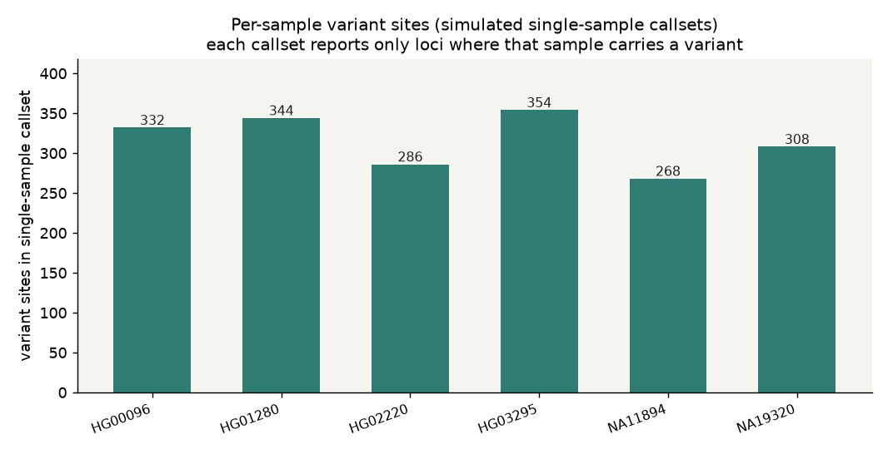
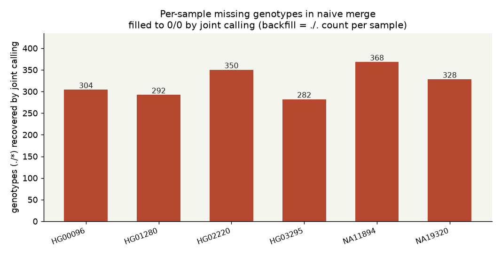
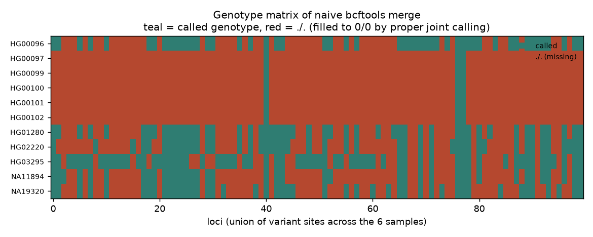

# 023 · bioSkills 真实试用：joint-calling（联合基因型）

## 功能定位与适用范围

`joint-calling` 讲解**把逐样本 gVCF 联合基因分型为队列 callset**。

- **适用**：在联合基因型与「合并单样本 callset」之间做选择（后者永远错误）；按队列规模与内存在 GenomicsDBImport 与 CombineGVCFs 之间选择；解决 N+1 问题；理解队列对低覆盖杂合位点的救援；处理跨越缺失的 `*` 星号等位与基因分型阶段的 GQ/PL 重算；按区间分片扩展到生物银行队列；在吞吐量考量下选择 DeepVariant + GLnexus。
- **不适用**：单样本调用（见 gatk-variant-calling）；VQSR/硬过滤机制（见 filtering-best-practices）。

本次真跑用一个可量化的对照实验落地第一条论断：同一批 6 个样本，「朴素 `bcftools merge` 单样本 callset」与「联合基因型口径」逐位点比对，直接数出两种口径的缺失基因型差距。

## 属性表（本次真跑环境）

| 项 | 值 |
|---|---|
| 执行环境 | WSL Ubuntu（root），conda env `bio` |
| bcftools | 1.24（htslib 1.24，2026-09-03 `bcftools --version` 实查） |
| GATK / GLnexus | **均未安装**（诚实边界：未从 BAM 重跑 GATK 流程） |
| 数据源 | 1000 Genomes Phase3 chr22:17.0–17.2 Mb（GRCh37/hs37d5），5431 条记录 × 2504 样本 |
| 对照组样本 | 6 个（跨族群抽样：HG00096, HG01280, HG02220, HG03295, NA11894, NA19320） |
| 实验产物 | `content/素材/variant-calling/023-joint-calling/`（run.sh、run_log.txt、joint_calling_stats.json、repro_transcript.txt、3 张 PNG） |

诚实标注：`joint6.vcf.gz` 是对既有联合 callset 做 `bcftools view -s` 的 6 样本子集抽取，以其平方化矩阵代表「真·联合基因型产物」；naive merge 分支为真实反模式演示。

## 成分拆解

### 1. 联合调用带来什么

- **共享证据带来的统计功效**：一个样本里只有 2 条 alt 读段的位点是边缘的、通常会被漏掉。若队列里另有 50 个样本在同一位点也各有 2 条 alt 读段，证据就是压倒性的。联合调用把这种「每样本微弱」的信号聚合成强队列级证据。
- **通过队列先验精化基因型**：个体基因型似然与队列等位频率作为贝叶斯先验结合。常见变异位点（AF=0.3）上的杂合调用，比在无人携带的位点上的同样调用获得更多支持。该先验显著提升低覆盖样本的准确性。
- **一致的位点表示**：所有样本在相同位点被基因分型，适用处产生纯合参考调用。没有联合调用时，缺失的基因型是歧义的：可能意味着纯合参考，也可能只是覆盖不足。
- **队列过滤资格**：VQSR 及其后继 VETS 作用于整个队列的变异分布，需要队列规模的变异计数——过滤本质上是一个队列操作，不是逐样本操作。

### 2. N+1 问题与 gVCF 的解法

朴素的联合调用在队列变化时重访每一个 BAM：加一个基因组就要重新调用全部 N 个。gVCF 工作流把昂贵的**逐样本发现**（局部组装 + PairHMM 似然，每样本只捕获一次）与廉价的**全队列基因分型**解耦。此后加入第 N+1 个样本只需生成那一个 gVCF，并重跑廉价的合并与 GenotypeGVCFs。gVCF 是可复用的中间体；GenomicsDB 工作区可原地更新（`--genomicsdb-update-workspace-path`）。

### 3. 队列规模决策表

| 队列规模 | 方法 | 说明 |
|---|---|---|
| < 100 | CombineGVCFs 或 GenomicsDB | 两者皆可；CombineGVCFs 更易管理 |
| 100–10,000 | GenomicsDB + GenotypeGVCFs | 标准 GATK Best Practices；按染色体分片 |
| 10,000–100,000 | GATK Biggest Practices | 跨区间重度分片与并行 |
| > 100,000 | DeepVariant + GLnexus，或 Hail VDS | GATK 在此规模变得笨重；需要专用工具 |

### 4. GenomicsDBImport vs CombineGVCFs

| | GenomicsDBImport | CombineGVCFs |
|---|---|---|
| 存储 | TileDB 阵列后端上的 GenomicsDB 工作区；把以样本为中心的 gVCF 转置为以位点为中心的稀疏二维阵列（样本 × 位置） | 纯 Java 层次合并为单个组合 gVCF |
| 扩展性 | N 大时最优；以位点为中心的转置正是大规模下逐位点基因分型快的原因 | N 增长时失效——吃内存且慢；仅作为小队列的退路 |
| 可移植性 | 工作区不是普通 gVCF；须通过 `gendb://` 做基因分型 | 产出是普通 gVCF，可移植、可检视 |
| 增量 | 用 `--genomicsdb-update-workspace-path` 加新样本（实践中的 N+1 收益） | 无增量模式；对所有样本重跑 |
| 适用 | > 100 样本，按区间分片，生物银行规模 | < 100 样本，或简单性优先的小家系/三人组 |

**GenomicsDBImport 特有的内存地雷**：重活在原生 C/C++（TileDB）中运行，因此要把 JVM 堆（`--java-options -Xmx`）限制在内存的约 80–90%。过度分配 JVM 会使原生层缺内存，导致一个看起来与堆大小无关的原生 OOM。

### 5. GenotypeGVCFs 重算了什么（为什么它不是复制）

GenotypeGVCFs 从存储的逐样本 PL 向量（含 `<NON_REF>` 似然）在贝叶斯模型下**重新联合推导**基因型；它不是把逐样本基因型复制进一个更宽的文件。两个后果在读输出时很重要：

- **GQ 与 PL 是针对最终确定的队列等位集合重算的。** 一旦全队列的真实 ALT 等位已知，`<NON_REF>` 似然被重新分配到它们上面，PL 随之重算；GQ 则是两个最小 PL 之差。因此**一个样本在联合 VCF 中的基因型/GQ 可能与其单样本 gVCF 所暗示的不同**——这是救援机制在起作用，不是 bug。
- **等位频率先验来自 `--heterozygosity`**（期望 theta，人类约 0.001）与 `--indel-heterozygosity`，把队列等位计数折进每个样本的后验。`--stand-call-conf`（约 30）丢弃低于该 QUAL 的位点。

### 6. 多等位与跨越缺失的 `*` 等位

- **`--max-alternate-alleles`** 限制每个位点参与基因分型的 ALT 等位数（保留支持最多的）。基因分型开销大致随 ALT 计数指数增长，因此 GATK 对其设限且不鼓励调高；`--max-genotype-count` 类似地约束基因型构型数。
- **`*` 跨越/重叠缺失等位**（VCF 4.3 保留）出现在「落在某些样本所携带的上游缺失内部」的变异位置。它的含义是「对于携带该上游缺失的样本，这些碱基被删除/不存在」——既不是参考，也不是本地 ALT。这类样本被判为 `*/A` 或 `*/*`，正确地避免了把缺失携带者在内部位点上误判为纯合参考。下游工具必须对它特殊处理：VEP/SnpEff 没有可预测后果的 ref/alt 序列，而 `bcftools norm` 的分解经常会拆分或过滤掉它。

### 7. 过滤是队列操作

过滤联合 VCF 是全队列步骤，且必须**在联合基因型之后**运行。VQSR（及其后继 VETS）把模型拟合到队列范围的位点注释分布——其高斯混合需要足够的变异与足够的真值资源重叠才能收敛。

| 队列 | 过滤 | 原因 |
|---|---|---|
| 单个深 WGS，或联合队列（约 30+ 外显子） | VQSR，或 VETS | 有足够变异拟合稳定的多变量模型；若已输出等位特异注释则传 `-AS` |
| 单个外显子、基因 panel，或变异太少 | 硬过滤 | GMM 在过少变异上不收敛；改用固定的每注释阈值 |

### 8. 联合调用中的批次效应

联合基因分型缓解了大部分批次效应，因为它同时重估所有样本的基因型似然。但某些批次效应会穿透联合调用，因为它们影响的是底层读段数据而非基因分型模型：不同文库构建方案（PCR-free vs PCR-based）、不同捕获试剂盒（靶向区域不同）、显著不同的覆盖分布（10× WGS 与 30× 混合）、不同参考基因组版本（混合 GRCh37 与 GRCh38 比对无效）、混合 WGS 与 WES。缓解办法：所有样本走完全相同的上游流程；若批次不可避免，在下游关联分析中把批次作为协变量纳入。

### 9. DeepVariant + GLnexus 替代路线

GLnexus 是一个可扩展的 gVCF 合并/联合基因分型引擎，随样本加入**增量式**增长。Yun 等针对 DeepVariant 输出调整了质量阈值，优化后的预设随 GLnexus v1.2.2+ 发布为 `DeepVariantWGS`（全基因组）与 `DeepVariantWES`（全外显子）。

| 指标 | DeepVariant + GLnexus | GATK（VQSR） |
|---|---|---|
| SNP F1 错误 | 0.07% | 1.23% |
| Indel F1 错误 | 1.14% | 2.92% |
| 队列孟德尔违规率 | 1.7% | 5.0% |
| chr22 队列合并时间（2504 样本） | 0.84 h | 6.83 h |
| 队列 gVCF 占用 | 2.20 TB | 15.16 TB |

这些是一个研究在特定版本/覆盖度下的数字，应视为代表性而非普适。吞吐差距（GLnexus 合并约快 8 倍，DeepVariant gVCF 磁盘占用约小 7 倍）是大型 DeepVariant 队列使用 GLnexus 的实际原因。

## 严格复现（本次真跑）

完整命令与输出见 `repro_transcript.txt`（含 run.sh 命令清单、run_log.txt 全文节选、stats.json 摘要）。

**评估史（诚实交代）**：2026-09-01 的复现难度评估称本机无 WSL/Docker、GLnexus 无 Windows 原生二进制、逐样本 gVCF 输入获取成本高，当时结论为「无法真跑」；2026-09-02 起 WSL Ubuntu 的 bio 环境已具备 bcftools，该阻塞结论**作废**；2026-09-03 用 bcftools 1.24 完成本次全链路真跑。

**① 对照实验设计**

同一份输入（chr22_slice.vcf.gz，5431 位点 × 2504 样本），取 6 个跨族群样本（`sed -n '1p;420p;840p;1260p;1680p;2100p'`），构造两条口径：

```
# 单样本口径：两步法抽出「仅报变异位点」的逐样本 callset，模拟单样本调用产物
bcftools view -s $s $IN -Ou | bcftools view -e 'GT="ref"' -Oz -o per_${s}.vcf.gz
# 朴素合并（反模式）
bcftools merge -Oz -o merged_naive.vcf.gz per_*.vcf.gz
# 联合口径：6 样本子集，平方化矩阵（每个位点 × 每个样本都有基因型）
bcftools view -s $SAMPLES $IN -Oz -o joint6.vcf.gz
```

两步法的原因：一步法同时写 `-s` 与 `-e 'GT="ref"'` 会让 GT 表达式在全部样本上求值，得到错误结果。

**② 朴素合并的缺失规模（核心实测数字）**

| 指标 | 朴素 merge 口径 | 联合口径 |
|---|---|---|
| 记录数 | 636 条 | 5431 条 |
| 基因型总数 | 3816 个 | 32586 个 |
| 缺失基因型（`./.`）累计 | **1924 个** | **0 个** |

逐样本（naive_missing / joint_missing，单位：个）：HG00096 304/0，HG01280 292/0，HG02220 350/0，HG03295 282/0，NA11894 368/0，NA19320 328/0。1924 个缺失全部是「该样本在此位点为纯合参考、但单样本 callset 没有这条记录」导致的 `./.` 回填——联合口径把这些格子填成 `0/0` 等真实基因型。

**③ 已调用位点的 GT 一致性**

在该样本被 merge 保留的 636 个位点上逐位点比对两口径（run_log `gtcheck` 行）：6 个样本各 called=636 条，与联合口径的 GT 不一致数分别为 1、1、2、3、1、0 个（最多 HG03295=3 个，一致性 99.53%；NA19320 为 100.00%）。即 naive merge 不仅丢格子，在它保留的格子里也有少量 GT 与联合口径不同（本实验为等位无序比较口径下的 norm_mismatch）。

**④ 大队列产物特征核查（输入全量）**

对输入全量做 `bcftools stats -s -` 的 PSC 核查：2504 样本 × 5431 位点上缺失基因型总数 = 0，证实该整合集确为联合基因型产物（平方化矩阵）。`ALT == "*"` 的记录数为 0（发布集已处理，`*` 等位的下游影响本次无法实测）。

### 本次出图







## 未覆盖（诚实标注）

本环境 GATK 与 GLnexus 均未安装、无逐样本 BAM，以下部分未做真跑，仅为文档口径与命令模板：

- `HaplotypeCaller -ERC GVCF` 的逐样本产出与 GQ 分带区块。
- `CombineGVCFs` / `GenomicsDBImport`（含 `--genomicsdb-update-workspace-path`、`--batch-size`、片段累积与 `--consolidate`）。
- `GenotypeGVCFs` 的 GQ/PL 重算、`<NON_REF>` 消解、`--max-alternate-alleles` 截断行为。
- `ReblockGVCF` + `GnarlyGenotyper` 的「Biggest Practices」扩展路径。
- GLnexus 的 `DeepVariantWGS` / `DeepVariantWES` 预设。
- `*` 跨越缺失等位对注释工具（VEP/SnpEff）与 `bcftools norm` 分解行为的影响（本数据该类记录为 0）。

## 实践要点

- **永远用 gVCF 联合基因型，不要 `bcftools merge` 单样本 callset**：本次实测 6 样本 × 5431 位点，naive merge 缺失 1924 个基因型（联合口径缺失 0）；缺失记录是 `./.` 而不是 `0/0`，会把等位频率与关联检验搞错。
- **`-s` 与 `-e` 分两步跑**：一步法同时写会让 GT 表达式在全部样本上求值。
- **数一遍缺失基因型就能判断 callset 来源**：平方化矩阵缺失为 0；naive merge 的缺失随「样本检出位点数差异」线性放大。
- **GenomicsDBImport 的 JVM 堆控制在内存的 80–90%**：重活在原生 TileDB 层，堆给多了会引发看似无关的原生 OOM。
- **联合 VCF 里出现 `*/A`、`*/*` 是预期行为**，注释前须特殊处理或拆分 `*` 记录。
- **过滤必须在联合基因型之后、且是队列级操作**；外显子/panel 不足约 30 样本时退回硬过滤。
- **混合 GRCh37 与 GRCh38 比对无效**；所有样本必须同参考、同上游流程。

## 小结

joint-calling 的核心是「用 gVCF 的参考置信度把每个单元格由证据填满，而不是由假设填充」。本次在 WSL bio 环境（bcftools 1.24）完成真跑：6 样本对照实验量化了 naive merge 的代价——记录数 636 vs 5431、缺失基因型 1924 vs 0、已调用位点 GT 不一致每样本不超过 3 个；同时核查了 2504 样本全量输入的平方化特征（缺失 0）。GATK/GLnexus 流程本身仍为文档口径，见「未覆盖」。

（数据与可复现脚本见 `content/素材/variant-calling/023-joint-calling/`，含 `run.sh`、`run_log.txt`、`joint_calling_stats.json`、`make_figs.py`、`repro_transcript.txt` 及三张图。）
