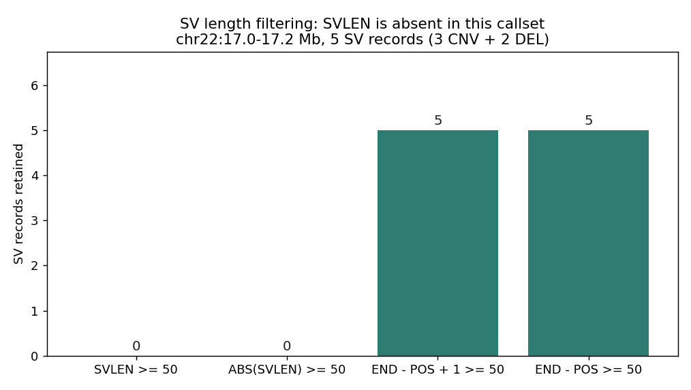
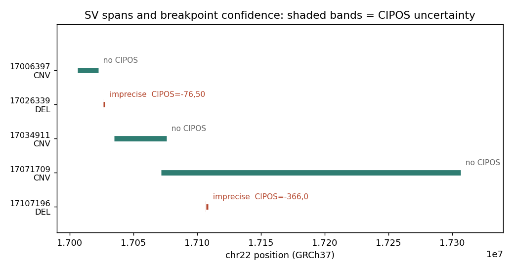

# 024 · bioSkills 真实试用：structural-variant-calling（结构变异检测）

## 功能定位与适用范围

`structural-variant-calling` 讲解**从短读长或长读长数据检测 ≥50 bp 的结构变异**（缺失、插入、倒位、重复、易位）。

- **适用**：按「融合哪些信号」选择 SV 调用器并预判其盲区；解读 SVLEN 符号 / 符号等位 vs BND / CIPOS 的表示法；用强制基因分型（force-genotyping）构建队列矩阵而非合并 discovery VCF；用序列感知的 Truvari（而非仅按位置的 SURVIVOR）做群体合并；参数化 Truvari 基准；判断何时短读长的插入召回率迫使切换到长读长。
- **不适用**：纯拷贝数剂量分析（见 copy-number/cnvkit-analysis）。

## 治理原则：SV 发现是信号重建，不是碱基判定

SV 调用器不是 pileup 基因型判定器。**SV 从不被任何一条读段直接观测**，而是从四类正交信号推断出来的，每个调用器只融合其中一部分。它的盲区直接由它遗漏了哪些信号决定：

1. **异常读段对（RP）**——插入片段大小或方向偏离文库分布。DEL 使表观插入片段变大；串联 DUP 产生外翻（`+/+`/`-/-`）配对；INV 使一条链的方向翻转；染色体间事件把配对分到两条染色体上。RP **永远看不到连接点碱基**，只能把断点定位到片段大小的不确定性范围内（约 ±300–500 bp）。
2. **分裂读段 / 软剪切（SR）**——一条读段分两段比对到不连续位置，记录在 BAM 的 SA（附加比对）标签中。剪切点**就是**断点，碱基级分辨率（约 ±0–10 bp）。需要一条跨过连接点且两侧都有唯一锚定的读段——当重复序列长于读长、或插入大于（读长 − 锚定长度）时不可能实现。
3. **读段深度（RD）**——拷贝数变化改变局部覆盖度（杂合 DEL 约 0.5×，DUP 约 1.5×，纯合 DEL 约 0×）。这是断点落在不可比对重复序列中的大 CNV 的**唯一**信号；对剂量不变的平衡事件（INV、平衡 BND）完全盲。分辨率受分箱大小限制（100 bp–1 kb），是四类中最差的。
4. **局部组装（AS）**——从剪切/异常读段中重新组装跨断点的 contig 再比对回去。可恢复精确的连接点序列、微同源和插入碱基；能解析没有任何单条读段跨越的事件。能力最强、开销最大；这是 GRIDSS/Manta/SvABA 区别于 LUMPY 的地方。

| 调用器 | RP | SR | RD | 组装 | 主要盲区 |
|---|:--:|:--:|:--:|:--:|---|
| Manta | 是 | 是 | 仅过滤/打分 | 是（定向、断点局部） | 超出局部 contig 的大 INS；重复区内的平衡事件 |
| DELLY | 是 | 是（SR 重比对精化） | 是（`delly cnv` 模块） | 无 de novo | INS（仅小的、SR 锚定的）；精度低于组装类调用器 |
| LUMPY / smoove | 是 | 是（概率模型） | 否 | 否 | **完全无 INS**（没有表示新插入序列的方式） |
| GRIDSS2 | 是 | 是 | 经 GRIPSS/PURPLE 下游 | 是（全基因组位置 de Bruijn 图） | 无连接读段的纯 RD 型 CNV；长重复序列内部 |
| SvABA | 是 | 是 | 否 | 是（全基因组 SGA 局部组装） | 大 INS 仍受组装限制；多 kb 级 DEL/DUP 依赖 RP 连锁 |
| CNVnator | 否 | 否 | 是（RD 分箱均值漂移） | 否 | 一切平衡事件；无断点分辨率；无小 SV |

### 真正的权衡是灵敏度 vs 断点分辨率（而非 vs 特异性）

- 偏重 RP 的调用**最大化灵敏度**（一条配对跨越连接点很容易，低深度也行），但断点**不精确**（±数百 bp，`CIPOS=-289,301`）。
- 偏重 SR / 组装的调用**最大化分辨率**（碱基级精确，`CIPOS=0,0`），但在任何读段无法干净跨越连接点的地方（重复序列、低深度、大 INS）**丢失灵敏度**。

约 30× 以下 SR 信号变稀（跨越任一连接点的读段变少），调用器会静默滑入低分辨率的「仅 RP」状态。一个要求 SR 确认的调用器会给出漂亮的断点、却漏掉临床上有意义的重复介导事件；一个接受仅 RP 调用的调用器能找到更多、但交回的是很宽的置信区间。

## 调用器选择

| 调用器 | 融合的信号 | 最适用 | 失效 / 不适用 |
|---|---|---|---|
| Manta | RP+SR+定向 AS | 默认胚系/体细胞；最快的具备组装能力的调用器（30× 下不到一小时） | WES/panel **不加 `--exome`**（高深度过滤会静默丢掉真实 SV）；超出局部组装的大 INS |
| DELLY | RP+SR（+RD CNV 模块） | 队列（先出位点列表再重新基因分型）；INV/BND | 通用大 INS 检测；需要重复区内碱基级断点 |
| smoove（LUMPY） | RP+SR（概率） | 简单、默认值合理的中低深度胚系流程 | **任何 INS 关键流程**（结构上 INS 召回为零） |
| GRIDSS2 | RP+SR+全基因组 AS | 最高精度；体细胞；单断点（病毒整合、着丝粒） | 把原始 VCF 当 callset 用（它是断点**图**——须跑 GRIPSS/PURPLE/LINX）；需要速度 |
| SvABA | RP+SR+全基因组 AS | 20–300 bp 的 indel/SV「过渡地带」；癌症中的模板化插入检测 | 大型平衡事件；Manta 速度已够用时 |
| CNVnator / CNVpytor | 仅 RD | 断点落在不可比对重复序列中的剂量型 CNV | 平衡 SV；任何断点精度需求 |
| Sniffles2 / cuteSV / pbsv | 长读段比对 | INS、重复介导的 SV、定相 SV、群体 `.snf` 合并 | 只有短读段时 |

共识做法：跑 DELLY + Manta + SvABA + GRIDSS2（后者先经 GRIPSS 过滤，因为其原始 VCF 是断点图而非 callset），要求 **≥2/4 一致**——单例富集假阳性，取交集以少量召回换取大幅精度提升。注意：这会压低 INS 召回（LUMPY 类盲区把交集结果拖下去）；INS 密集的工作应改用一个组装类调用器 + 图基因分型器，或改用长读段。

## 平台检测上限

| SV 类型 | 短读长 | 长读长 | 关键限制 |
|---|---|---|---|
| 缺失 | 好（RP+SR） | 优秀 | 短读长漏掉埋在重复序列中的 DEL |
| 重复 | 中等（RP+RD） | 好 | 串联 vs 分散在短读长下不可靠 |
| 倒位 | 中等（RP） | 好 | 断点落在重复序列导致假阴性 |
| 插入 | **差（召回约 30–50%）** | 优秀（90%+） | 物理极限：没有短读段能跨过大于读长的 INS |
| 易位 | 中等（异常配对） | 好 | 着丝粒/端粒附近高假阳性 |
| 复杂/嵌套 | 差 | 好（组装） | 重叠的 SV 混淆短读长信号 |

插入是**物理极限**，不是调参失败。定位并确定一个 INS 的大小需要跨越两个连接点**外加**新碱基的读段；当插入超过读长（Illumina 150 bp）时，没有任何读段能跨越它，且若不组装则插入序列不可恢复——而短读长组装在插入本身是重复序列（可动元件、VNTR）时又会失败。GIAB HG002 Tier 1 中 INS 比 DEL **更多**（≥50 bp 的 INS 7,281 个 vs DEL 5,464 个），但 INS 恰是短读长最难的一类。Ebert 2021 发现 107,590 个组装发现的 SV 中有 68% 被短读长漏掉。**不要拿短读长的 INS 去对长读长真值集做基准然后怪调用器——约 30–50% 是构造上的天花板。**

## VCF 表示法

VCF 规范用三种方式表示 SV，而各调用器在这三种上都不一致：

- **SVTYPE**——类别（DEL/INS/DUP/INV/BND）。
- **END（INFO）**——同一条染色体上的另一个断点。**POS 是最后一个未受影响的锚定碱基**，所以 `POS=1000, END=2000` 的 DEL 移除的是 1001–2000。这里的差一错误会污染每一个长度计算。（VCF 4.4 开始弃用符号等位的 INFO/END；bcftools/GATK 仍输出并消费这一经典字段。）
- **SVLEN**——**带符号**长度：按历史惯例 DEL 为**负**、INS/DUP 为正（Manta、DELLY 遵循；有些工具输出绝对值）。**绝不能对裸 SVLEN 做过滤而不加 `ABS()`**，否则一个朴素的 `SVLEN >= 50` 会丢掉每一个缺失。
- **CIPOS / CIEND**——置信区间，编码的正是 RP vs SR 的分辨率故事：SR 解析的断点是 `CIPOS=0,0`，仅 RP 的是 `CIPOS=-289,301`。这是「我能在多大程度上信任这个断点」的依据，也正是群体合并器必须尊重的东西。
- **IMPRECISE（flag）**——断点由 RP/深度推导而非连接点解析时置位；其缺失意味着 PRECISE。一个全是 IMPRECISE 的 callset 无法做紧合并。

**断点（BND）记法**——最容易搞错的部分。两个侧面不构成简单同染色体跨度的重排，写成由 `MATEID` 关联的**成对 BND 记录**，其 ALT 字符串的括号方向编码了连接方向：

```
2   321681  bnd_V  T  ]13:123456]T   MATEID=bnd_U
13  123456  bnd_U  A  A[2:321681[    MATEID=bnd_V
```

一次相互易位是 2 条 BND 记录；染色体碎裂是几十条构成的图。**同一个生物学倒位**可能表现为：Manta 里的 `<INV>`、GRIDSS 里的 2 条以上 BND 记录、或一个朴素 RD 调用器里的 DEL+DUP 假象对——不理解这一点的合并器会把它数三遍或丢掉。

## 严格复现（本次真跑：bcftools 表示法部分）

数据源：1000G Phase3 chr22:17.0–17.2 Mb（GRCh37/hs37d5），5431 条记录。完整命令与输出见 `repro_transcript.txt`。

**① SV 记录构成**

```
SVTYPE 分布：CNV 3 条、DEL 2 条
含 END 的记录：5 条 ；含 CIPOS 的记录：2 条
```

**② SVLEN 表示法的真实坑（本次核心实测）**

| 过滤表达式 | 保留记录数 |
|---|---|
| `SVLEN >= 50` | **0** |
| `ABS(SVLEN) >= 50` | **0** |
| `INFO/END-POS+1 >= 50` | **5** |
| `INFO/END-POS >= 50` | **5** |

本 callset 的 `SVLEN` **完全未填充**（其 header 明确写道：SVLEN 只对可动元件类 SV 计算，其他类型可用 `INFO:END-START+1` 或 REF/ALT 长度差计算）。结果是：**连 `ABS()` 也救不回来**——文档强调的「DEL 为负，必须 `ABS()`」这一条成立的前提是字段存在；字段缺失时，朴素的 `SVLEN >= 50` 与加了 `ABS()` 的版本都返回 0 条，把全部 5 个真实 SV 静默丢光。正确做法是按 END 与 POS 自行计算长度。

**③ 长度口径的差一问题（真实记录）**

POS 是最后一个未受影响的锚定碱基，因此同一条记录用两种口径会得到相差 1 的长度：

| POS | END | SVTYPE | `END-POS` | `END-POS+1` | CIPOS |
|---|---|---|---|---|---|
| 17006397 | 17022734 | CNV | 16337 | 16338 | — |
| 17026339 | 17027748 | DEL | 1409 | 1410 | `-76,50` |
| 17034911 | 17076240 | CNV | 41329 | 41330 | — |
| 17071709 | 17306387 | CNV | 234678 | 234679 | — |
| 17107196 | 17108416 | DEL | 1220 | 1221 | `-366,0` |

在 50 bp 这一阈值上两种口径都保留 5 条，所以计数看不出差别；但逐条记录的长度确实相差 1 bp——在需要按长度做精确匹配（Truvari 的 `--pctsize`、等位频率目录的等位判重）时，这个差一会造成系统性错配。

**④ 断点置信区间（RP vs SR 的分辨率证据）**

2 条 DEL 带 CIPOS（`-76,50` 与 `-366,0`），说明其断点由 RP/深度推导而非连接点解析；3 条 CNV 无 CIPOS。这直接对应文档的分辨率论述：`CIPOS=-366,0` 意味着该断点有 366 bp 的左侧不确定性。

**⑤ 区域提取的边界行为**

`POS=17071709 END=17306387` 的 CNV 跨度 234,678 bp，**超出了 17.2 Mb 的提取窗口右边界**仍被保留——这是 `-r` 按重叠而非按包含取记录的直接例证（与 017 观察一致）。

## 未覆盖（诚实标注）

本环境 **delly / manta / sniffles / SURVIVOR / truvari / glnexus 均未安装**，且无可用的比对 BAM，因此以下部分未做真跑，仅记录文档口径与命令模板：

- SV 调用本身（Manta / DELLY / smoove / GRIDSS2 / SvABA / 长读段调用器）。
- duphold 深度过滤（`DHFFC < 0.7`、`DHBFC > 1.3`）——需 BAM 与基因型化的 VCF。
- 强制基因分型（svtyper / Paragraph / GraphTyper2 / `delly -v` 位点重判）。
- 群体合并（SURVIVOR / Jasmine / Truvari——「合并参数本身就是结果」这一论点无法用真实数据量化）。
- Truvari 基准（`--refdist` / `--pctsize` / `--pctseq` / `--sizemin` 参数敏感性）。
- iVar 无关的病毒部分不适用。

### 本次出图





## 实践要点

- **先判断字段是否存在再过滤**：`SVLEN` 缺失时 `ABS()` 也无效，改用 `END-POS`（+1 与否按口径统一）。
- **记住 POS 是最后一个未受影响的锚定碱基**：长度与坐标换算都要考虑这个差一。
- **CIPOS 是断点可信度的依据**，也是群体合并必须尊重的信息；全 IMPRECISE 的 callset 不能紧合并。
- **INS 是物理极限**：短读长约 30–50% 是天花板，不要拿长读长真值集去苛责短读长调用器。
- **不要 union discovery VCF 当队列矩阵**：0/0 可能只是「该样本没发现」，必须强制基因分型。
- **AF 相关工作用序列感知的 Truvari**：仅按位置合并会把 AF 抬高最多 2.2 倍。
- **WES/panel 用 Manta 必须加 `--exome`**，否则高深度过滤静默丢真实 SV。

## 小结

structural-variant-calling 的本质是「按信号集选调用器，并接受它的盲区」。本次虽无 SV 调用器可用，但用真实 SV 记录完成了表示法层面的实测，得到一个比文档更细的结论：**`SVLEN` 未填充时，`ABS(SVLEN)` 与裸 `SVLEN` 过滤都会静默返回 0 条**——`ABS()` 只对「字段存在但符号为负」有效，对「字段整体缺失」无效。同时量化了长度口径的差一问题与 CIPOS 所反映的断点分辨率差异。

（数据与可复现脚本见 `content/素材/variant-calling/024-sv-calling/`，含 `make_figs.py`、`chr22_slice.vcf.gz`、`repro_transcript.txt` 及两张图。）
