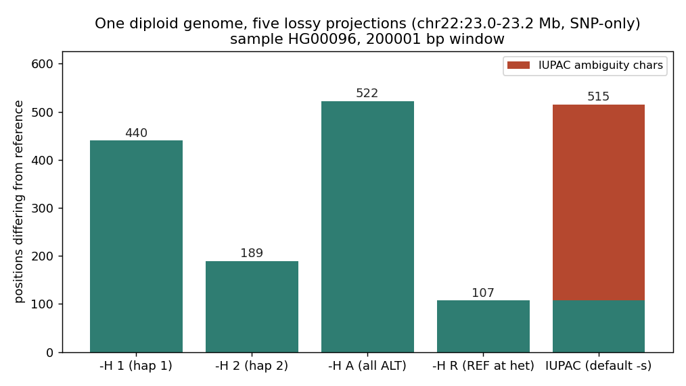
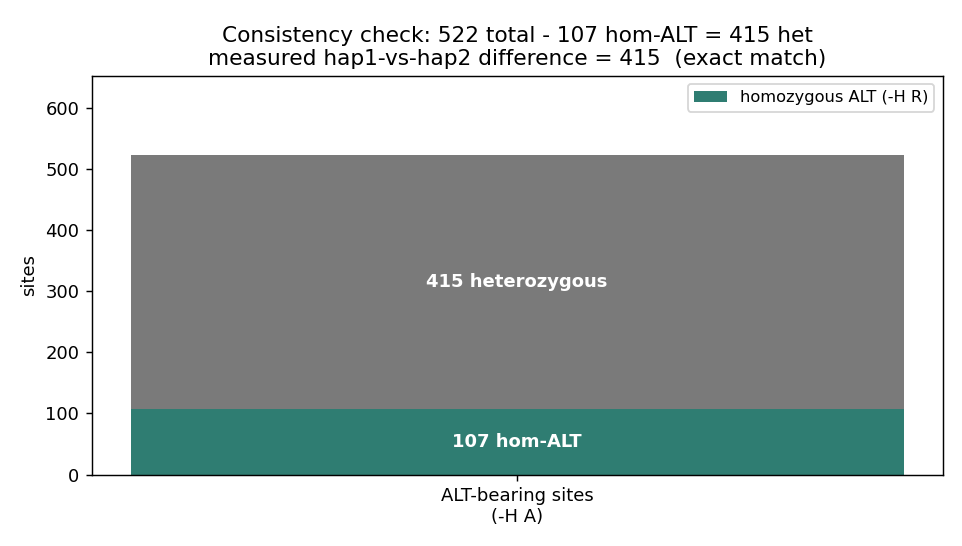

# 025 · bioSkills 真实试用：consensus-sequences（一致性序列）

## 功能定位与适用范围

`consensus-sequences` 讲解**把 VCF 变异应用到参考序列上，生成样本特异序列**的方法。

- **适用**：重建样本特异参考或单倍型；决定用 `-H` 单倍型投影 / IUPAC 简并码 / 全 ALT 投影；对无覆盖位点做 masking 以免制造假的「参考」调用；为病毒/扩增子测序设定 iVar 的 min-depth / min-frequency 策略。
- **不适用**：符号 SV 的直接应用（`<DEL>`/`<INS>` 无 ALT 序列）；需要连锁信息的分析（应保留 VCF 或两条定相单倍型）。

## 治理原则：三个会毁掉 consensus 分析的特性

`bcftools consensus` 沿参考序列走，在 VCF 出现变异的位置替换 ALT 碱基，**其余一切原样照抄参考**。由此产生三个特性：

1. **VCF 沉默的位置一律输出参考碱基——包括覆盖度为零的位置。** 「无数据」与「确证参考」在输出里完全相同。未做 masking 的 consensus 会在样本从未被测到的位置制造假信心。
2. **在未定相的 VCF 上用 `-H 1` 会得到嵌合的伪单倍型。** 单倍型选择只在基因型已定相时有意义；未定相时它会把来自不同真实染色体的等位混进一条在任何细胞里都不存在的序列。
3. **单个 FASTA 无法忠实表示一个二倍体基因组。** 每种投影（`-H 1`、`-I`、`-H A`）都以不同方式有损；对相位敏感的工作应保留 VCF，而非 consensus。

输入要求：VCF 必须 **bgzip + 索引**（`.csi` 或 `tabix -p vcf`），plain-gzip 或无索引会报错；VCF 的 REF 碱基必须与 FASTA 完全一致，否则 bcftools 会告警并跳过这些记录。

## 属性表（本次真跑环境）

| 项 | 值 |
|---|---|
| 数据源 | 1000 Genomes Phase3 chr22（GRCh37 / hs37d5），窗口 22:23.0–23.2 Mb |
| 样本 | HG00096（从 5 样本子集取出） |
| 基因型定相状态 | **已定相**：8261 个 GT 全部使用 `|`，使用 `/` 的为 0 |
| 工具 | bcftools 1.24 / samtools 1.21 |
| 参考 | hs37d5（远程 range 提取） |
| 产物 | `content/素材/variant-calling/025-consensus/` |

## 成分拆解

### 1. 单倍型选择与定相前提

`-H` 决定从 `FORMAT/GT` 中取哪个等位（大小写不敏感）：

| 选项 | 应用内容 | 适用场景 |
|---|---|---|
| `-H 1` / `-H 2` | GT 中第 1 / 第 2 个等位 | 输出一条真实染色体——**仅对已定相基因型有效** |
| `-H A` | 每个基因型中的 ALT 等位 | 与参考的最大差异度；是两条染色体的嵌合体 |
| `-H R` | 杂合位点取 REF 等位 | 保守 consensus；丢弃杂合 ALT 等位 |
| `-H I`（或独立 `-I` / `--iupac-codes`） | IUPAC 简并码 | 在一条序列里保留杂合信息 |
| `-H LA`/`LR`/`SA`/`SR` | 较长/较短等位，等长时由 ALT/REF 打破平局 | 长度驱动的选择 |

**嵌合单倍型问题**：`-H 1`/`-H 2` 只在基因型定相（`0|1`，竖线分隔）时有意义。未定相（`0/1`，斜杠）时，「哪个等位属于单倍型 1」的指派是**每个位点各自任意**的，跨多个杂合位点取 `-H 1` 就产生一个 switch-error 镶嵌体，它不对应任何真实染色体——但看起来像一条干净的单倍型 FASTA。这是 consensus 最危险的错误。取单倍型前必须验证定相：

```bash
bcftools query -f '%CHROM\t%POS[\t%GT]\n' input.vcf.gz | head   # 定相: 0|1 ；未定相: 0/1
```

未定相则需先定相（读段支持的 WhatsHap/HapCUT2、家系 trio、统计法 SHAPEIT/Eagle——对常见变异准确、对稀有/singleton 差——或长读段原生定相）。

### 2. 单个 consensus 无法表达的东西

| 策略 | 标志 | 最适用 | 丢失 |
|---|---|---|---|
| 两条单倍型序列 | `-H 1` + `-H 2`（已定相） | 等位特异表达、复合杂合、HLA、顺式调控单倍型 | 无（若定相正确） |
| IUPAC 简并码 | `-I` | 一条序列里保留杂合信号 | 相位/连锁；**许多建树与比对工具把 IUPAC 当作 N** |
| 全部 ALT 等位 | `-H A` | 最大差异度、快速草稿 | 真实性——在任何细胞中都不存在 |
| 杂合位取 REF | `-H R` | 保守单条序列 | 每一个杂合 ALT 等位 |

两条硬边界：

- **相位敏感的工作应保留 VCF（或两条已定相单倍型 FASTA），而不是单个 consensus。** 把杂合压成 IUPAC 或只挑一个等位会丢弃分析所需的连锁关系——把 consensus FASTA 当作「该样本的基因组」去做复合杂合或等位特异分析属于范畴错误。
- **`bcftools consensus` 无法应用符号 SV 等位**（`<DEL>`、`<INS>`、`<DUP>`、`<INV>`）：它们不携带 ALT 序列，只有 INFO 字段，consensus 没有可替换的内容。短读长 SV VCF（Manta/DELLY）大多是符号式的，**不能直接做 consensus**。

对系统发育分析，优先用一条干净的已定相单倍型或「仅纯合 ALT」序列，而不要用 IUPAC——简并码会被许多建树程序静默丢弃：

```bash
bcftools view -i 'GT="AA"' input.vcf.gz | bcftools consensus -f reference.fa > hom_alt.fa
```

### 3. Masking 无覆盖位点（承重的部分）

由于未观测位置会被输出为参考碱基（特性 1），必须用覆盖度构造 mask。`-m mask.bed` 把列出的区域替换为指定字符（默认 N，`--mask-with N`）。mask 必须由**可 call 深度**构造，而这一步藏着一个静默 bug：

**`samtools depth` 不加 `-a` 会省略零覆盖位置**——那些位置因此不会进入低深度 BED、永远不会被 mask、最终仍是参考碱基：正是 mask 本该防止的假信心失败。必须加 `-a`（报告所有位置）：

```bash
samtools depth -a aligned.bam | awk '$3 < 10 {print $1"\t"$2-1"\t"$2}' | bedtools merge > lowcov.bed
bcftools consensus -f reference.fa -m lowcov.bed input.vcf.gz > consensus.fa
```

`bedtools genomecov -bga -ibam aligned.bam` 是等价的、同样感知零覆盖的替代（它也会输出 0 深度区间）。

不要依赖 `-M`/`-a` 来做这件事：`-M N` 只对 VCF 中已存在的缺失基因型 `./.` 输出 N；`-a N` 替换所有 VCF 中不存在的位置（会把整个非变异基因组变成 N）。**只有深度导出的 mask 才能区分「无覆盖」与「确证参考」**。

### 4. consensus 前的规范化

未规范化或重叠的 indel 会产生错误序列，而 `bcftools consensus` 只向 stderr 告警同时照样输出——除非检查 stderr，否则这种损坏是静默的。即使 norm 之后，REF 跨度冲突的两条记录仍是隐患：

```bash
bcftools norm -f reference.fa input.vcf.gz -Oz -o norm.vcf.gz
bcftools index norm.vcf.gz
bcftools consensus -f reference.fa norm.vcf.gz 2>&1 >consensus.fa | grep -i 'overlap\|warn'
```

### 5. 病毒 / 扩增子 consensus（iVar）

`-m`（最小深度，默认 10）与 `-t`（判 base 的最小频率，默认 0 即多数决）是**流行病学策略决策**，不是可盲目接受的默认值——它们会传导到谱系判定与传播簇推断。

| 标志 | 默认 | 决策含义 |
|---|---|---|
| `-m` min depth | 10 | 低于此输出 N。过低→单条读段的测序错误变成「突变」，污染暴发系统发育；过高→N 过多，基因组碎裂不可用 |
| `-t` min frequency | 0（多数决） | 严格多数 consensus 用 0.5。过低→把宿主内次等位与污染烤进「基因组」，制造幻影传播链。做宿主内变异研究才刻意降到 0.03 |
| `-q` min base quality | 20 | 低于此的碱基不计入深度/频率 |
| `-n` no-coverage char | N | 深度低于 `-m` 时输出的字符 |

必须先做引物修剪（`ivar trim`）：引物来源的碱基不是样本序列，在引物结合位点发生突变时会导致参考偏向的错误判定。

## 严格复现（本次真跑）

完整命令与输出见 `repro_transcript.txt`。

**① 定相状态核验（`-H` 的前提）**

```
bcftools query -f '[%GT]\n' dense5.norm.vcf.gz | grep -c '|'   →  8261
bcftools query -f '[%GT]\n' dense5.norm.vcf.gz | grep -c '/'   →     0
```

1000G Phase3 整合集**全部已定相**，因此本数据上 `-H 1` / `-H 2` 是合法操作。

**② 版本差异：`-r` 在本机不可用**

SKILL.md 写「用 `-r` 限制区域」，但本机 bcftools 1.24 的 `consensus` **不接受 `-r`**（`invalid option -- r`），长选项 `--regions` 也不存在（被解析为 `--regions-overlap`）。可用的方式只有帮助里给出的管道法：

```bash
samtools faidx ref.fa 22:23000000-23200000 | bcftools consensus s1.vcf.gz -o out.fa
```

这与 017 记下的「版本差异须以 `--help` 为准」是同一类问题。本次所有 consensus 调用均用该管道法。

**③ 符号等位导致失败（文档记载的限制，本次实测复现）**

直接跑 `-H 1` 会失败并输出空文件，stderr 为：

```
Symbolic alleles other than <DEL>, <*> or <NON_REF> are currently not supported,
e.g. "<INS:ME:ALU>" at 22:23170887.
Please use filtering expressions to exclude such sites, for example by running with: -e 'ALT~"<.*>"'
The site 22:23104069 overlaps with another variant, skipping...
```

按文档给出的修正式 `-e 'ALT~"<.*>"'` 排除符号等位后成功：`Applied 492 variants`，输出长度 199898 bp（因删除而短于参考的 200001 bp）。同时出现的「位点重叠跳过」告警也印证了规范化章节提到的隐患。

**④ 五种投影的定量比较（SNP-only，保证等长 200001 bp）**

为排除 indel 造成的移码干扰，用 `bcftools view -v snps` 取 SNP-only 子集（7975 条）后再生成各投影：

| 投影 | 与参考的差异位点数 | IUPAC 简并字符数 |
|---|---|---|
| `-H 1`（单倍型 1） | 440 | 0 |
| `-H 2`（单倍型 2） | 189 | 0 |
| `-H A`（全部 ALT） | 522 | 0 |
| `-H R`（杂合取 REF） | 107 | 0 |
| IUPAC（默认 `-s`） | 515 | 408 |

**⑤ 内部自洽性检验（本次最有价值的实测）**

- `-H A` 给出全部含 ALT 位点数 = **522**。
- `-H R` 在杂合位点取 REF，因此其差异数只反映**纯合 ALT** 位点数 = **107**。
- 二者相减得杂合位点数 = 522 − 107 = **415**。
- **实测 `-H 1` 与 `-H 2` 两条序列之间的差异 = 415** —— 与推算值完全吻合。

这条恒等式说明：在已定相数据上，`-H 1`/`-H 2` 输出的确实是两条各自真实的单倍型，每个杂合位点在两条序列上恰好各贡献一个差异。若数据是未定相的，`-H 1`/`-H 2` 仍会输出「看起来干净」的序列，但这条恒等式不再成立——这提供了一个**无需外部真值集即可自检定相正确性**的手段。

同时可见各投影的有损程度：`-H A`（522）比任一真实单倍型都多，因为它把两条染色体的 ALT 合并进一条不存在的序列；`-H R`（107）最保守，丢掉了全部杂合 ALT 等位；IUPAC（515 个差异位、其中 408 个是简并字符）保留了杂合信号但丢失了相位与连锁。

## 未覆盖（诚实标注）

- **无覆盖 masking（`-m`）**：本环境无对应 BAM，无法用 `samtools depth -a` 构造真实的低深度 BED 并演示 masking 效果；仅记录方法与「必须加 `-a`」的原理。
- **indel 的 consensus 应用**：本次为等长比较改用 SNP-only；indel 场景已通过 199898 bp（短于参考 200001 bp）间接确认删除被正确应用。
- **iVar / ViralConsensus**：无病毒数据，未做真跑。
- **链文件（`-c`）与命名前缀（`-p`）**：未做真跑演示。

### 本次出图





## 实践要点

- **用 `-H 1`/`-H 2` 前必须验证定相**（`|` vs `/`），否则得到嵌合伪单倍型；可用「`-H A` − `-H R` = hap1-vs-hap2 差异」这条恒等式自检。
- **符号 SV 等位无法应用**，用 `-e 'ALT~"<.*>"'` 排除；短读长 SV VCF 不是 consensus 的合适输入。
- **consensus 前先 `bcftools norm`**，并 grep stderr 的 overlap/warn。
- **masking 必须由深度构造且 `samtools depth` 要加 `-a`**，否则零覆盖位置逃逸。
- **相位敏感分析保留 VCF 或两条定相单倍型**，不要用单个 consensus；建树避免 IUPAC。
- **区域限制在 bcftools 1.24 的 consensus 上无 `-r`**，用 `samtools faidx` 管道法。

## 小结

consensus-sequences 的核心是「把二倍体投影成序列时必然有损，必须明确选择投影方式并处理无覆盖位点」。本次用真实已定相数据完成了五种投影的定量比较，并得到一个可复用的自检恒等式（522 − 107 = 415 = hap1/hap2 实测差异），同时实测到两个文档级限制：符号等位不可应用、以及本机 `consensus` 不支持 `-r`。

（数据与可复现脚本见 `content/素材/variant-calling/025-consensus/`，含 `make_figs.py`、各投影 FASTA、`sample_snps.vcf.gz`、`repro_transcript.txt` 及两张图。）
