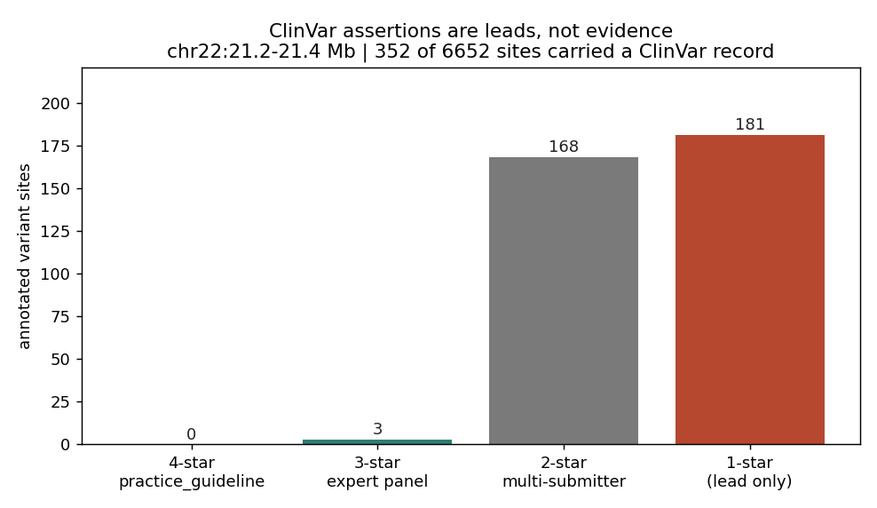
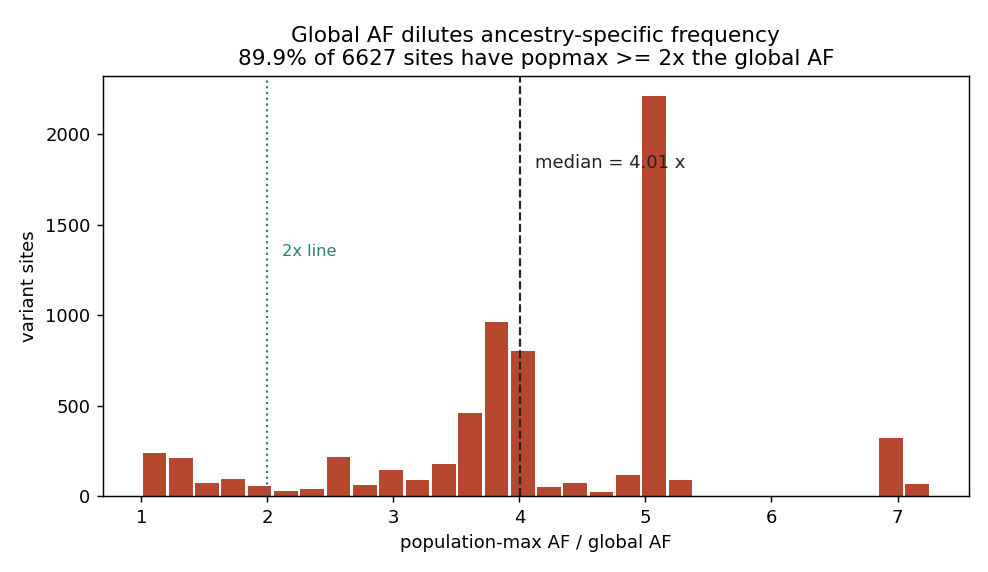

# 026 · bioSkills 真实试用：clinical-interpretation（临床变异解读）

## 功能定位与适用范围

`clinical-interpretation` 讲解**用 ACMG/AMP 框架（及其 2018–2025 ClinGen 修订）判定变异临床意义**的方法。

- **适用**：选择胚系 vs 体细胞框架；应用当前（而非扁平 2015 版）的 ACMG 要点；检查某基因是否有 VCEP 规范；判断一条 ClinVar 断言或 gnomAD 频率能否作为证据；校准致病性预测因子；在 MANE Select 转录本上评估 PVS1；建立 VUS 复分析回路。
- **不适用**：功能注释本身（见 variant-annotation）。

## 治理原则

变异的临床意义**不是数据库查询**，而是相对于一个钉死的上下文（基因组版本、MANE Select 转录本、基因致病机制、疾病患病率、框架版本）对**独立、已校准**证据线做的贝叶斯求和。三个会拖垮朴素流程的特性：

1. **扁平的 2015 默认值已过时。** 当前分类器须应用 ClinGen SVI 修订（PVS1 分级、PM2 降为 Supporting、PP5/BP6 退役、PP3/BP4 校准、贝叶斯计点）。
2. **胚系与体细胞是不同的问题、不同的框架。** 「是否导致孟德尔疾病」（ACMG）vs「在本肿瘤类型中是否可干预」（Li 分级、Horak 致癌性）。对体细胞变异套用 ACMG 是范畴错误。
3. **ClinVar 断言是线索，不是证据。** 提交者之间的一致不等于独立；1 星不可用；必须从底层数据重新推导。

## 属性表（本次真跑环境）

| 项 | 值 |
|---|---|
| 人群数据 | 1000 Genomes Phase3 chr22（GRCh37 / hs37d5），窗口 22:21.2–21.4 Mb |
| 注释源 | ClinVar GRCh37 VCF（远程按区段提取；chr22 共 96,854 条） |
| 窗口选择依据 | ClinVar 在 chr22 上 200 kb 窗口密度最高者（5,550 条） |
| 样本 | 子集 5 个（HG00096 / HG00097 / HG00100 / HG00101 / HG00102） |
| 工具 | bcftools 1.24（annotate / norm / query） |
| 产物 | `content/素材/variant-calling/026-clinical/` |

## 成分拆解

### 1. 先选框架

| 变异来源 | 框架 | 回答的问题 |
|---|---|---|
| 胚系（体质性） | ACMG/AMP + ClinGen SVI | 对某孟德尔疾病的 Pathogenic..Benign |
| 体细胞（肿瘤），可干预性 | AMP/ASCO/CAP 分级 I–IV | 在**该肿瘤类型**中的诊断/预后/治疗意义 |
| 体细胞，致癌性 | ClinGen/CGC/VICC 计点 | Oncogenic..Benign（是否为驱动） |

在套用通用 ACMG 之前，**先查该基因是否有 ClinGen VCEP 规范**（如听力损失、RASopathy、心肌病、ENIGMA BRCA1/2）。VCEP 规范会重新加权并约束判据，**覆盖通用默认值**；一条 3 星 ClinVar 断言往往就反映了某个 VCEP 规范。

### 2. 2015 基线与必须应用的修订

2015 共识定义了五级分类与 28 条编码判据（PVS1 极强，PS1-4 强，PM1-6 中等，PP1-5 支持；BA1 独立，BS1-4 强，BP1-7 支持）。当前不应再用原始 2015 规则，须叠加：

| 修订 | 变化 | 对分类器的影响 |
|---|---|---|
| PVS1 分级（Abou Tayoun 2018） | PVS1 是决策树，不是任何 null 都自动成立 | 按 NMD + 机制以 Very Strong / Strong / Moderate / Supporting 输出 |
| PM2 → Supporting（ClinGen SVI，2020-09 批准） | 在 gnomAD 中缺失只是弱证据 | 仅按 Supporting 应用，永不用 Moderate |
| PP5 / BP6 退役（Biesecker & Harrison 2018） | 断言不能替代证据 | 永不使用；改为引用底层数据 |
| PP3 / BP4 校准（Pejaver 2022） | 计算证据是分级的，不是扁平 Supporting | 每类证据用一个已校准工具，按校准强度使用 |
| 贝叶斯计点（Tavtigian 2018/2020） | 语言化组合规则近似朴素贝叶斯 | 改为求和；分级/分数强度是自洽的 |

**贝叶斯计点**：Supporting +1、Moderate +2、Strong +4、Very Strong +8（良性侧按同量级扣分）。按总分判定：Pathogenic ≥ 10、Likely Pathogenic 6–9、VUS 0–5、Likely Benign −1 至 −6、Benign ≤ −7（良性切点须对照 Tavtigian 2020 原文确认后再硬编码）。

**PVS1 决策树与 NMD 50-nt 规则**：先按基因 LOF 机制分流，再按变异类型，再按 NMD 预测与外显子位置。PTC 位于最后一个外显子-外显子连接处上游 **>~50-55 nt** → 触发 NMD → 真实 LOF → 满强度；位于**最后一个外显子**、或距最终连接处 **~50 nt 以内**、或单外显子基因 → **逃逸 NMD**，截短蛋白仍生成 → 按丢失的蛋白量与结构域降级。PVS1 还要求 LOF 是该基因**已确立**的致病机制（单倍剂量不足）；功能获得/显性负效基因里的 null 不得触发 PVS1。评估应在 MANE Select 转录本上进行，而不是「哪个异构体最严重就用哪个」。

### 3. ClinVar：断言是线索

| CLNREVSTAT | 星 | 能否作为证据 |
|---|---|---|
| `practice_guideline` | 4 | 最强的单库信号；仍需对照当前证据核验 |
| `reviewed_by_expert_panel` | 3 | VCEP；强，常隐含基因规范 |
| `criteria_provided,_multiple_submitters,_no_conflicts` | 2 | 共识；须核查提交者是否共享同一错误 |
| `criteria_provided,_single_submitter` | 1 | **仅线索——不能作为证据** |
| `criteria_provided,_conflicting_classifications` | 1 | 冲突是有信息量的信号，不是可平均的噪声 |
| `no_assertion_criteria_provided` | 0 | 无权重 |

规则：1 星 / 无判据不是证据；冲突的解释标记出真正困难的变异（外显率、祖先、机制），应调查而非平均；一致不等于独立（两个提交者可能复制同一个原始错误）。PP5/BP6 之所以退役，正是因为断言不能作为证据输入。

挂载与读取（**必须同时携带 CLNREVSTAT**，否则 1 星调用会被误当成证据）：

```bash
bcftools annotate -a clinvar.vcf.gz \
    -c INFO/CLNSIG,INFO/CLNDN,INFO/CLNREVSTAT input.vcf.gz -Oz -o with_clinvar.vcf.gz
bcftools view -i 'INFO/CLNSIG~"athogenic"' with_clinvar.vcf.gz \
  | bcftools query -f '%CHROM:%POS %REF>%ALT\t%INFO/CLNSIG\t%INFO/CLNREVSTAT\n'
```

### 4. 群体频率：用 grpmax 过滤 AF，不用全局截断

**过滤等位频率 FAF** 是 grpmax（各遗传祖先组中最高的 AF）的 **95% CI 下界**——gnomAD v4 为 `fafmax_faf95_max`（外显子+基因组联合 VCF 为 `fafmax_faf95_max_joint`）。用 grpmax 而非全局 AF，可避免把某一祖先中常见的变异在整个队列中稀释掉；取 CI 下界可防范小子群估计的噪声。规则：FAF 超过该疾病的最大可信群体 AF 时应用 BA1/BS1——**这是按疾病的**。

「在 gnomAD 里出现」不等于良性。例外：隐性疾病中健康携带者使致病等位处于携带者频率（如 CFTR p.Phe508del）；迟发/低外显率等位出现在成人队列（BRCA、Lynch）；体细胞/克隆造血污染使 DNMT3A/TET2 出现低 AF 调用；同聚物/segdup 区域的伪影——应尊重 gnomAD 的 PASS/质量标记而非裸 AF。gnomAD 各祖先组采样不均，因此「缺失」对采样不足的祖先是弱得多的证据。

### 5. 致病性预测因子：一个、已校准

只选一个在校准中达到 ≥ Strong 的预测因子，并按其校准阈值使用。堆叠相关工具会伪造独立性并静默过度判病。REVEL 的复现良好的 Supporting 阈值为 PP3 ≥ 0.644、BP4 ≤ 0.290。**SIFT 与 PolyPhen-2 在校准中未达 Supporting**，且是 REVEL 的组成部分，与 REVEL 并列引用属于重复计数。**原始 CADD 未达 PP3 的 Supporting**，而开发者推荐的 CADD ≥ 20 在校准中映射到**良性** Moderate。SpliceAI 的 delta 是预测值，转成 PS3/PP3 强度需要 ClinGen 剪接校准，且它不报告错误剪接的**结果**（外显子跳跃 vs 内含子滞留），而那才是决定 PVS1 适用性的东西。

### 6. 分类有有效期

分类是相对于其日期上可得证据的快照。应建立复分析回路：定期用最新的 ClinVar 与 gnomAD 版本重新注释已存储的 VCF，标记证据发生变化的 VUS。

```bash
bcftools annotate -a clinvar_latest.vcf.gz -c INFO/CLNSIG_NEW:=INFO/CLNSIG \
    prior_results.vcf.gz -Oz -o reannotated.vcf.gz
bcftools view -i 'INFO/CLNSIG~"Uncertain" && (INFO/CLNSIG_NEW~"athogenic" || INFO/CLNSIG_NEW~"enign")' \
    reannotated.vcf.gz -Oz -o reclassified.vcf.gz
```

## 严格复现（本次真跑）

完整命令与输出见 `repro_transcript.txt`。

**① 选择窗口（第一次选址注释交集为零，主动换区）**

- 先在 23.0–23.2 Mb 试跑：该窗口 ClinVar 记录数为 **0**，无法演示注释。
- 改为扫描 ClinVar 在 chr22 上的全部 96,854 条记录，按 200 kb 窗口计密度，取最高者 **21.2–21.4 Mb（5,550 条）**。该区域对应 22q11.21。

**② 数据准备与真实注释**

- ClinVar 窗口提取：5,550 条；1000G 同窗口：6,599 条 → 子集 5 样本 → `norm -m-any` 后 6,652 条（split 48、realigned 16）。
- ClinVar GRCh37 的 contig 命名为 `1..22`，与 1000G 一致，无需重命名（若用 GRCh38 的 `NC_000022.10` 风格命名则需 `bcftools annotate --rename-chrs`）。
- `bcftools annotate -c INFO/CLNSIG,INFO/CLNDN,INFO/CLNREVSTAT` 后，**6,652 条中有 352 条（5.3%）命中 ClinVar 记录**。

**③ 星级分层（「断言是线索」的量化）**

| 星级 | 位点数 | 占比 |
|---|---|---|
| 3 星 `reviewed_by_expert_panel` | 3 | 0.9% |
| 2 星 `multiple_submitters,_no_conflicts` | 168 | 47.7% |
| 1 星（含 `single_submitter` 与 `conflicting_classifications`） | 181 | **51.4%** |

**51.4% 的注释是 1 星——按规则只能当线索，不能当证据**；可作证据候选的 ≥2 星仅 171 条（48.6%）。本窗口无 4 星（`practice_guideline`）记录。

**④ CLNSIG 分布**

| 分类 | 位点数 |
|---|---|
| Uncertain_significance | 99 |
| Benign | 98 |
| Likely_benign | 84 |
| Benign/Likely_benign | 43 |
| Conflicting_classifications_of_pathogenicity | 24 |
| Likely_pathogenic | 4 |

本窗口无 `Pathogenic`。注意 `Conflicting_classifications_of_pathogenicity` 有 24 条——按规则应作为「该变异确实困难」的信号去调查，而不是平均成 VUS。

**⑤ grpmax vs 全局 AF（用 1000G 五大人群 AF 作为真实代理）**

1000G 整合集自带 `EAS_AF / EUR_AF / AFR_AF / AMR_AF / SAS_AF`，可直接构造群体最大 AF（popmax）与全局 AF 的对比：

- 可比较位点 6,627 个。
- **popmax / 全局 AF 的比值：中位数 4.01，均值 4.11，最大 7.26。**
- **89.9% 的位点 popmax ≥ 2 倍全局 AF。**

这说明「用全局 AF 做阈值」会系统性地把祖先特异的频率稀释掉——正是文档要求改用 grpmax FAF 的原因。

**⑥ 频率与分类的关系（也是「全局截断双向都错」的证据）**

| CLNSIG | 位点数 | 中位 AF | 最大 AF |
|---|---|---|---|
| Benign | 98 | 0.0397 | 1.0000 |
| Benign/Likely_benign | 43 | 0.0010 | 0.1791 |
| Likely_benign | 84 | 0.0008 | 0.0549 |
| Conflicting_classifications | 24 | 0.0004 | 0.0022 |
| Uncertain_significance | 99 | 0.0002 | 0.0032 |
| Likely_pathogenic | 4 | 0.0002 | 0.0004 |

趋势清晰：Benign 的中位 AF（0.0397）约为 Uncertain（0.0002）的 200 倍，群体频率确实能区分良性与意义未明。

**但反向的坑同样真实**：`Likely_benign` 的中位 AF 只有 **0.0008**，远低于常用的 1% BA1 阈值——用一个全局 1% 截断，会把本窗口中**大多数真正的良性变异判成「罕见、因而值得怀疑」**。同时 `Benign` 组内最高 AF 达 1.0000（在群体中已固定），`Likely_benign` 最高 0.0549。这正是文档所说「全局截断双向都错」的实测证据：过松对超高外显率的罕见病无意义，过严会把祖先特异的奠基者等位误判为良性。

## 未覆盖（诚实标注）

- **ACMG 判据的实际组合与分类**：本数据集无 REVEL / AlphaMissense / SpliceAI 等已校准预测因子字段，也无 gnomAD `fafmax_faf95_max`，因此未做 PP3/BP4 与 PVS1 的完整判定；仅完成证据挂载与可用性分层。
- **VCEP 基因规范查询**：未做具体基因的规范检索。
- **体细胞框架**（AMP/ASCO/CAP 分级、ClinGen/CGC/VICC 致癌性）：无肿瘤数据，未做真跑。
- **VUS 复分析回路**：需要两个版本的 ClinVar，本次只用当前版本。
- **gnomAD v4 grpmax FAF 字段**：1000G 的五大人群 AF 是**代理**，不是 gnomAD 的 FAF 口径（后者是 grpmax 的 95% CI 下界）。

### 本次出图





## 实践要点

- **先选框架**：胚系用 ACMG/AMP + ClinGen SVI，体细胞用 Li 分级 + Horak 致癌性，切勿混用。
- **不要用扁平 2015 默认值**：PM2 只按 Supporting；PP5/BP6 已退役；PVS1 要走决策树。
- **ClinVar 断言必须连 CLNREVSTAT 一起带**：1 星只是线索，51.4% 的注释属于这一类（本次实测）。
- **频率用 grpmax FAF 而非全局 AF**：实测 89.9% 的位点 popmax ≥ 2 倍全局 AF，中位数 4.01 倍。
- **全局截断双向都错**：本次 `Likely_benign` 中位 AF 仅 0.0008，1% 阈值会漏判大多数真良性变异。
- **每类证据只用一个已校准的预测因子**；相关工具堆叠会伪造独立性。
- **建立 VUS 复分析回路**：分类是快照，会过期。

## 小结

clinical-interpretation 的核心是「分类不是查库，而是对独立、已校准证据做贝叶斯求和，且要定期重算」。本次用真实 ClinVar 注释完成了两项可量化的验证：**51.4% 的 ClinVar 注释是 1 星（不可作证据）**，以及**全局 AF 系统性稀释祖先特异频率（89.9% 的位点 popmax ≥ 2 倍全局 AF，中位 4.01 倍）**；并用 AF 与分类的关系实测到「1% 全局阈值会漏判大多数真良性变异」这一反向错误。

（数据与可复现脚本见 `content/素材/variant-calling/026-clinical/`，含 `make_figs.py`、`annotated.vcf.gz`、`clinvar_window.vcf.gz`、`repro_transcript.txt` 及两张图。）
